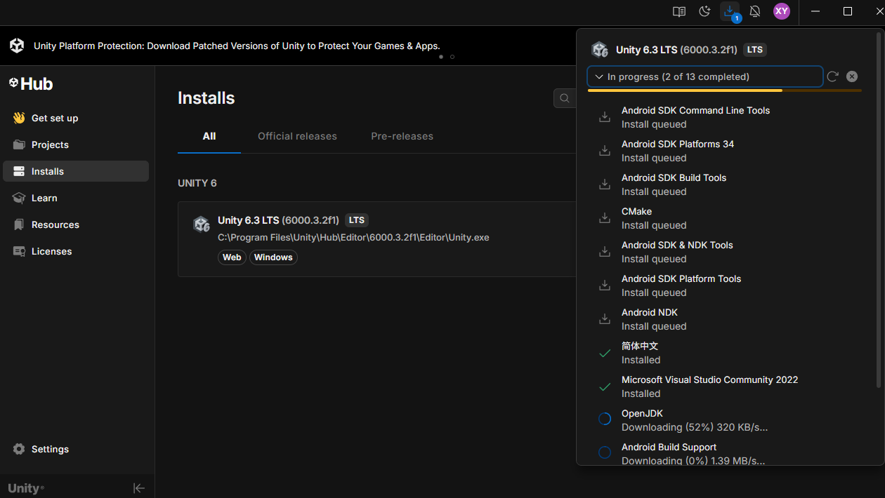
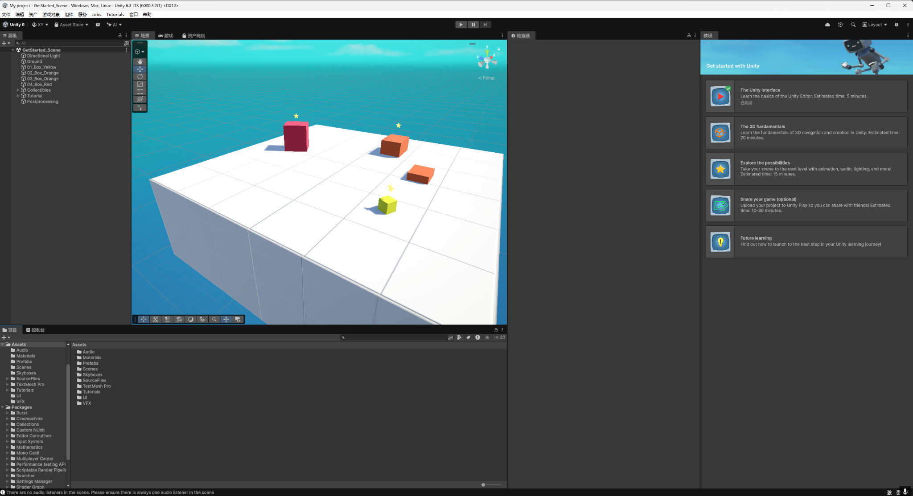

The goal of this Lab 2 was to set up a usable Unity development environment and complete a full basic workflow: creating a project, entering the editor, getting familiar with the core panels and operations, and validating the runtime pipeline using Play Mode. This ensures the environment is ready for upcoming course assignments.

## 1. Installation

I installed the Unity Editor through Unity Hub and selected Unity 6.3 LTS (6000.3.2f1) on Windows. I chose an LTS release primarily for stability and compatibility, which helps avoid package/plugin issues during iterative course work.

In addition to the editor itself, I installed common modules to support scripting and potential mobile/VR build targets:

- **Microsoft Visual Studio Community 2022** (C# editing and debugging)  
- **Simplified Chinese language pack** (to navigate editor features more efficiently)  
- **Android Build Support + OpenJDK** (including related SDK/NDK components) for potential Android/VR build pipelines  

The Unity Hub Installs page shows the installed editor version, installation location, and module installation status.

After installation, I verified the following:
- The editor version is listed in Unity Hub and can be launched directly
- The editor starts successfully and reaches the main interface
- Installed modules show a normal status in Unity Hub for later scripting/build workflows

## 2. Project Validation

After installation, I created and opened a 3D project. Inside the editor, I used the built-in “Get started with Unity” panel and its associated preset scene to practice core operations and validate the runtime workflow. The preset scene contains objects such as Ground, Box, Collectibles, and Postprocessing, which is useful for quickly checking asset loading, hierarchy structure, component setup, and rendering.

From the project state:
- The Hierarchy shows a clear object structure (e.g., Ground / Box / Collectibles / Postprocessing)
- The scene renders properly in both the Scene view and the Game view
- The guided panel provides a step-by-step introduction to the basic editor workflow

