This Lab 3 follows the Unity Learn Roll-a-ball workflow (Unity 6.3) and delivers a runnable minimal rolling-ball scene: I set up the ground and player sphere in a URP 3D project, configured lighting and materials, and implemented physics-based movement using a Rigidbody together with the new Input System (Player Input).  
On top of the tutorial baseline, I added surrounding walls to constrain the play area, and adjusted the camera angle and distance to make the gameplay view more stable and readable.

## 1. Project Creation and Scene Initialization

A new project was created in Unity Hub using the **Universal 3D (URP)** template, with Unity version **6000.3.2f1 (LTS)**.

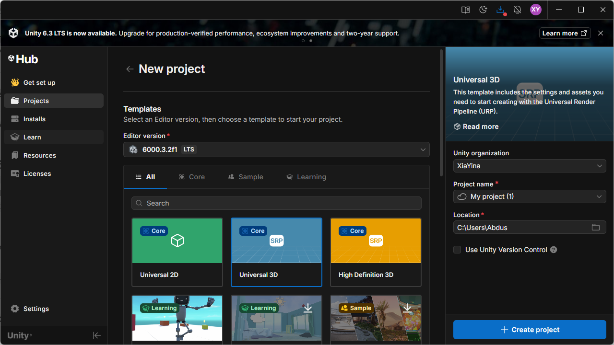

After opening the Editor, I created and saved a new scene (`MiniGame`, stored under `Assets/Scenes`). All subsequent objects and scripts were built and tested within this scene.

## 2. Scene Setup: Ground and Boundary Structure

### 2.1 Ground

I created a Plane and renamed it to `Ground`, then reset its Transform to place it at the origin. To enlarge the playable area, I set the Ground scale to **X=2, Z=2** (keeping Y at its default).

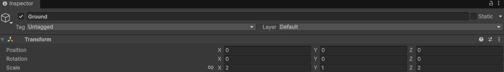

### 2.2 Walls

I placed four Cubes (`Cube1`–`Cube4`) around the ground as boundaries, forming a closed arena to prevent the ball from rolling out of the playable area. The walls keep the default Box Collider, so they collide properly with the player sphere.

The following figure shows how the wall objects are organized in the Hierarchy (Cube1–Cube4 in the same scene as Ground/Player):

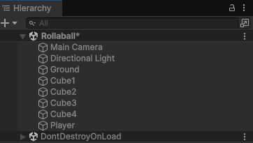

One wall (example: `Cube1`) uses the following parameters: Position **(10, 1, 0)** and Scale **(1, 2, 20)**. The other three walls are obtained through symmetric placement/rotation to ensure the arena is fully enclosed.

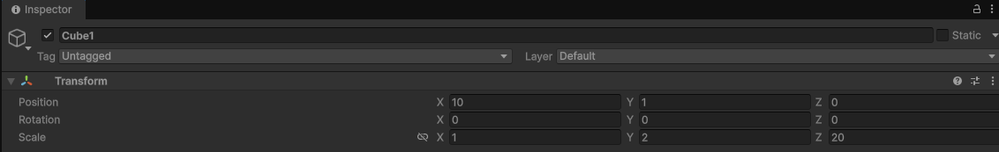

## 3. Player (Sphere) and Material Appearance

I created a Sphere and renamed it to `Player`. To keep the enlarged sphere sitting correctly on the ground, I set its scale to **(2, 2, 2)** and set its Position **Y=1** (radius = 1). This ensures the bottom of the sphere touches the ground and the setup remains visually stable.

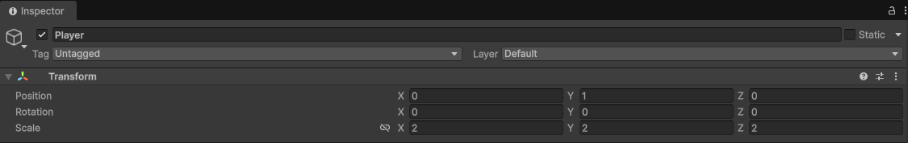

## 4. Lighting and Materials

To improve visual clarity, I created two materials and applied them to the scene:

- `Background` (Ground): light gray, **RGB 130/130/130**, Metallic=0, Smoothness≈0.25 (matte surface to reduce distracting reflections)
- `Player` (Sphere): light blue, **RGB 0/220/255**, Metallic=0, Smoothness≈0.75 (brighter and easier to track)

I also changed the Directional Light color to pure white (RGB 255/255/255) and set a more contrastive rotation (e.g., X=50, Y=50, Z=0), so the ball’s shadow changes are visible during rolling and collisions.

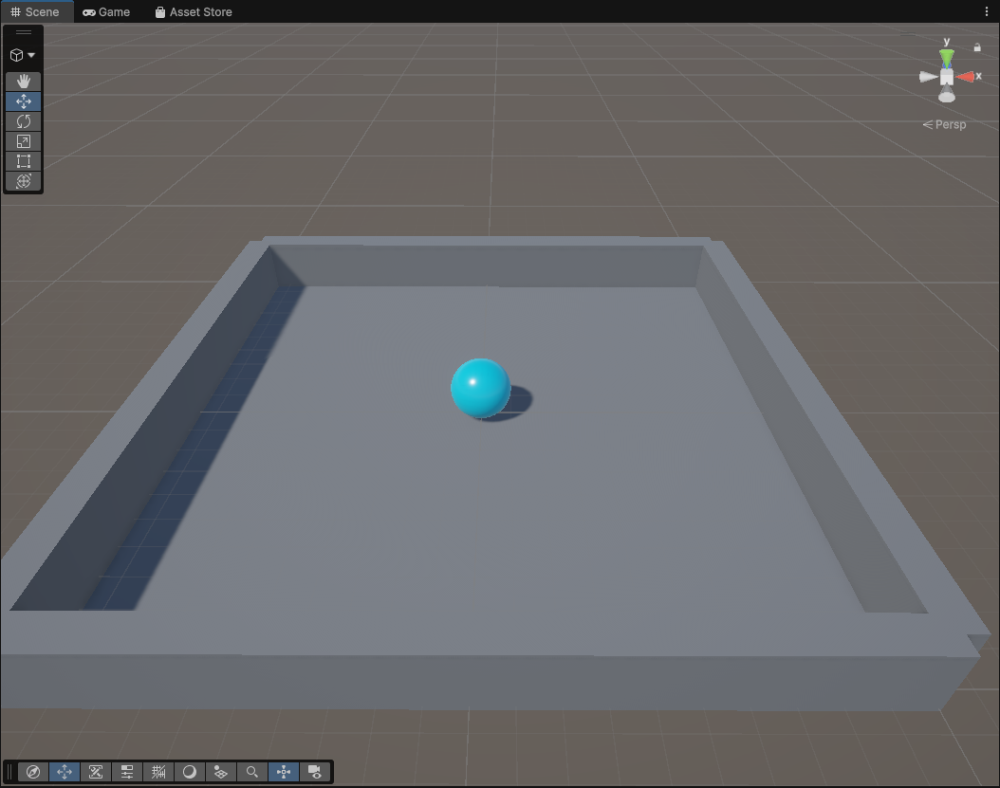

## 5. IP Paris Badge Texture on the Player 

I added an **IP Paris badge texture** to the player sphere.

First, I prepared the original IP Paris badge image:


Then, in an external image editor, I removed the text, set the background to black, and duplicated the badge **twice** (side-by-side) to create a cleaner repeated pattern:


After that, I imported the edited texture into Unity and placed it under the `Materials` folder:

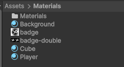

Finally, I applied it to the sphere by dragging the material/texture onto the `Player` object in the scene, so the logo appears directly on the ball surface:

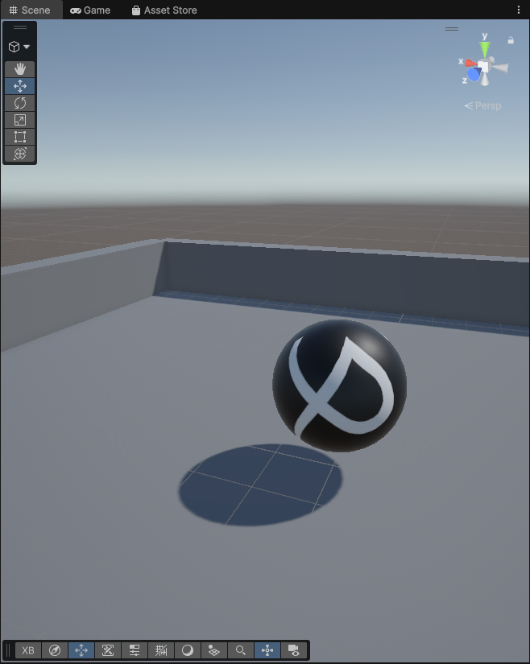

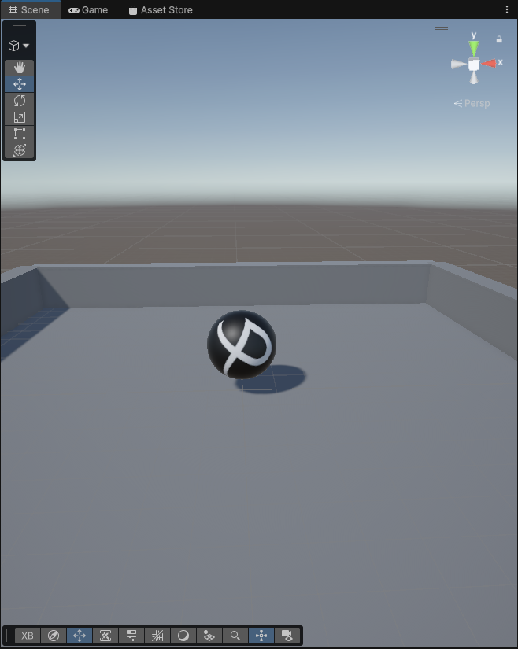


## 6. Movement Control: Rigidbody + Player Input + PlayerController

### 6.1 Component Setup

To drive the ball using physics, I added the following to `Player`:

- **Rigidbody**
- **Player Input** (new Input System)
- A custom script **PlayerController** (stored under `Assets/Scripts`)

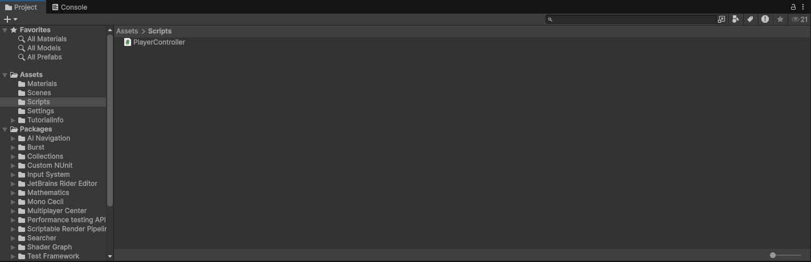

### 6.2 Control Logic

The control logic is:

- `OnMove(InputValue ...)` receives the 2D movement input (X/Y) from the Input System and stores it;
- `FixedUpdate()` (physics step) builds a 3D movement vector `(movementX, 0, movementY)`;
- `rb.AddForce(movement * speed)` applies force to the Rigidbody, resulting in a rolling-ball behavior;
- `speed` is exposed as a public parameter and set to **10** in the Inspector to achieve a reasonable movement speed.

Full code:

```csharp
using System.Collections;
using System.Collections.Generic;
using Unity.VisualScripting;
using UnityEngine;
using UnityEngine.InputSystem;
public class PlayerController : MonoBehaviour
{
    private Rigidbody rb;
    private float movementX;
    private float movementY;
    public float speed = 0;
    void Start()
    {
        rb = GetComponent<Rigidbody>();
    }
    void OnMove(InputValue movementValue)
    {
        Vector2 movementVector = movementValue.Get<Vector2>();
        movementX = movementVector.x;
        movementY = movementVector.y;
    }

    private void FixedUpdate()
    {
        Vector3 movement = new Vector3(movementX, 0.0f, movementY);
        rb.AddForce(movement * speed);
    }
}
```

## 7. Results and Validation

In Play Mode, the sphere responds to input, rolls across the ground, and collides with the surrounding walls without leaving the arena. The figure below shows the ball at different positions (including near-wall behavior), confirming that both the boundary setup and physics movement work as intended.

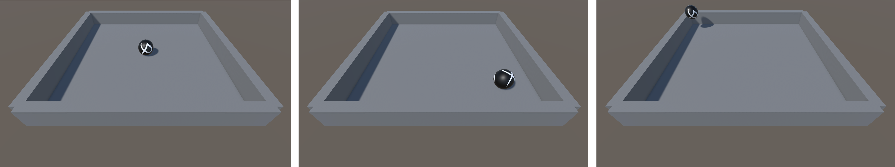


## 8. Extensions

This section extends Lab 3 into a more game-like minimal loop: **a stable camera setup (Approach A) + collectible objects (Pickups) + scoring/timing + a final win message**.


### 8.1 Approach A: Create a CameraRig (stable camera, not rolling with the ball)

In VR, attaching the camera to a rolling ball can easily cause motion sickness. Therefore, this project follows the “player as the controller” approach: the camera stays stable, and the player controls the ball moving inside the arena.

**Steps:**

1. In the Hierarchy, right-click → Create Empty, name it `CameraRig`.
2. Drag `Main Camera` under `CameraRig` as a child object.
3. Adjust the `Main Camera` position and rotation so it can consistently see the entire play area (a tilted top-down view is recommended, making the boundaries and the ball clearly visible).

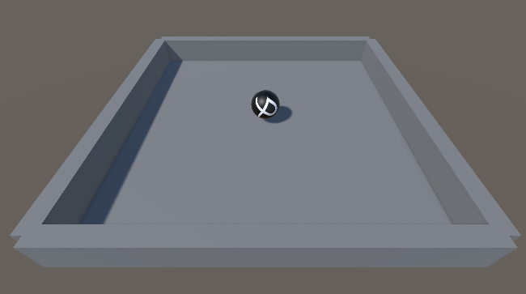


### 8.2 Core gameplay extension: Pickups + Score + Win (complete the game loop)

#### 8.2.1 Create a Pickup prefab (collectible object)

**Steps:**

1. Hierarchy → 3D Object → Capsule, name it `Pickup`.
2. Adjust Transform (example):
   - Scale: `(0.6, 0.6, 0.6)`
   - Position: slightly above the ground, e.g., `Y = 0.6`
3. The Capsule has a Collider by default: enable **Is Trigger** on the Collider.
4. Assign a clearly visible material (e.g., a bright color for easy recognition).
5. Drag `Pickup` into `Assets/Prefabs/` to create a prefab.
6. Go back to the Hierarchy and delete the temporary `Pickup` used to make the prefab (from now on, use the prefab instances only).

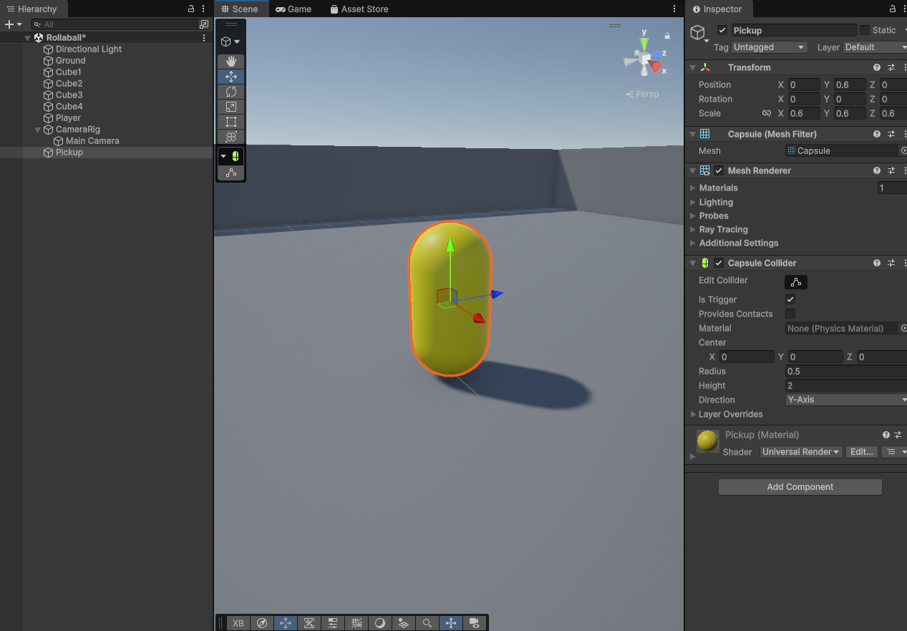

---

#### 8.2.2 Make the Pickup rotate

A rotation animation makes the collectible easier to notice and more like an interactive object.

Create `PickupRotator.cs` under `Assets/Scripts/`, then attach it to the **Pickup prefab**:

```c#
using UnityEngine;

public class PickupRotator : MonoBehaviour
{
    // Rotating only around Y looks cleaner and matches common collectible visuals
    public Vector3 rotateSpeed = new Vector3(0f, 120f, 0f);

    void Update()
    {
        transform.Rotate(rotateSpeed * Time.deltaTime, Space.World);
    }
}
```

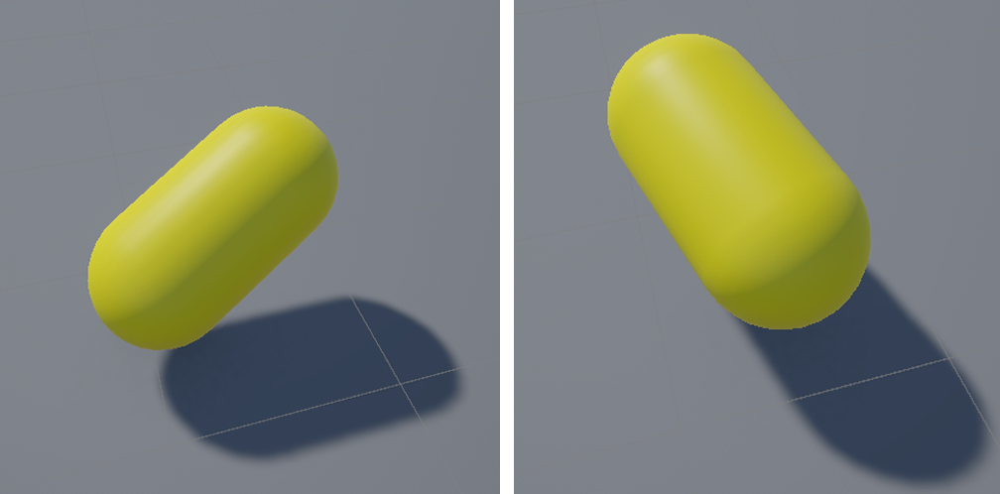

#### 8.2.3 Place the Pickups

Drag the prefab into the scene and duplicate it. In this lab, I placed **30** pickups and distributed them as evenly as possible across the arena, creating a clear exploration path and collection goal.

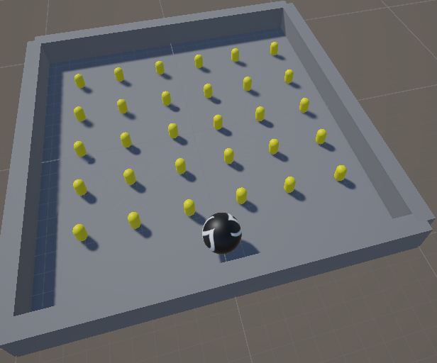


#### 8.2.4 Create UI (Score / Timer / Best / Win)

##### 8.2.4.1 Import TextMeshPro
Menu → Window → TextMeshPro → Import TMP Essential Resources

##### 8.2.4.2 Create a Canvas (screen-space UI; later switch to World Space for VR)
1. Hierarchy → UI → Canvas
2. Under the Canvas, create 4 TMP Text objects (UI → Text - TextMeshPro) and name them:
   - `ScoreText` (top-left)
   - `TimerText` (top-right)
   - `BestText` (top-right, below Timer)
   - `WinText` (center, large font; hidden by default)
3. The initial text of `WinText` can be “You Win!”.

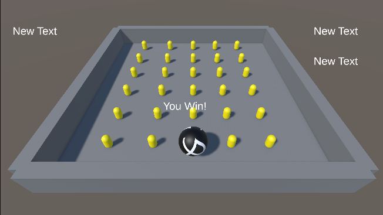


#### 8.2.5 GameManager: scoring + timing + best time + win condition

A global manager is created to:
- Count the total number of pickups at the start;
- Update Score / Timer in real time;
- Trigger a win state and save best time after collecting all pickups;
- Restart the level by pressing `R` after winning (useful for repeated testing).

**Steps:**
1. Hierarchy → Create Empty, name it `GameManager`.
2. Attach the script `GameManager.cs`.
3. In the Inspector, assign the 4 UI text references (ScoreText/TimerText/BestText/WinText).
4. Assign the `PlayerController` reference from the `Player` (the ball) to `GameManager.playerController` (optional: disable movement after winning).

`Assets/Scripts/GameManager.cs`:

```c#
using UnityEngine;
using TMPro;
using UnityEngine.SceneManagement;

public class GameManager : MonoBehaviour
{
    [Header("UI")]
    public TMP_Text scoreText;
    public TMP_Text timerText;
    public TMP_Text bestText;
    public TMP_Text winText;

    [Header("Config")]
    public string bestTimeKey = "BestTime";
    public bool stopPlayerOnWin = true;
    public PlayerController playerController;
    
    private int totalPickups;
    private int collected;
    private float timer;
    private bool finished;
    
    void Start()
    {
        // Count all objects in the scene that have a Pickup component
        totalPickups = FindObjectsOfType<Pickup>().Length;
    
        collected = 0;
        timer = 0f;
        finished = false;
    
        if (winText != null) winText.gameObject.SetActive(false);
    
        UpdateScoreUI();
        UpdateBestUI();
        UpdateTimerUI();
    }
    
    void Update()
    {
        if (!finished)
        {
            timer += Time.deltaTime;
            UpdateTimerUI();
        }
        else
        {
            // Press R to restart after winning (for testing)
            if (Input.GetKeyDown(KeyCode.R))
                SceneManager.LoadScene(SceneManager.GetActiveScene().buildIndex);
        }
    }
    
    public void OnPickupCollected()
    {
        if (finished) return;
    
        collected++;
        UpdateScoreUI();
    
        if (collected >= totalPickups)
            FinishGame();
    }
    
    void FinishGame()
    {
        finished = true;
    
        if (winText != null)
        {
            winText.text = $"You Win!\nTime: {timer:F2}s\nPress R to Restart";
            winText.gameObject.SetActive(true);
        }
    
        // Save best time (PlayerPrefs)
        float best = PlayerPrefs.GetFloat(bestTimeKey, -1f);
        if (best < 0f || timer < best)
        {
            PlayerPrefs.SetFloat(bestTimeKey, timer);
            PlayerPrefs.Save();
        }
        UpdateBestUI();
    
        // Optional: disable movement after winning
        if (stopPlayerOnWin && playerController != null)
            playerController.enabled = false;
    }
    
    void UpdateScoreUI()
    {
        if (scoreText != null)
            scoreText.text = $"Score: {collected} / {totalPickups}";
    }
    
    void UpdateTimerUI()
    {
        if (timerText != null)
            timerText.text = $"Time: {timer:F2}s";
    }
    
    void UpdateBestUI()
    {
        float best = PlayerPrefs.GetFloat(bestTimeKey, -1f);
        if (bestText != null)
            bestText.text = (best < 0f) ? "Best: --" : $"Best: {best:F2}s";
    }
}
```

---

#### 8.2.6 Pickup: trigger collection + self-destruction

When the ball enters the Pickup trigger:
- The Pickup notifies `GameManager` to update the score;
- Then destroys itself.

**Steps:**
1. Create `Pickup.cs` under `Assets/Scripts/`.
2. Attach it to the **Pickup prefab** (so all instances behave the same).
3. Set the ball object `Player` Tag to `Player` (Tag dropdown at the top of the Inspector).

`Assets/Scripts/Pickup.cs`:

```c#
using UnityEngine;

public class Pickup : MonoBehaviour
{
    public GameManager gameManager;

    void Start()
    {
        if (gameManager == null)
            gameManager = FindObjectOfType<GameManager>();
    }
    
    private void OnTriggerEnter(Collider other)
    {
        if (!other.CompareTag("Player")) return;
    
        if (gameManager != null)
            gameManager.OnPickupCollected();
    
        Destroy(gameObject);
    }
}
```

---

### 8.3 Result validation

In Play Mode, the following behaviors can be observed:
- The ball moves correctly and can trigger collections;
- The Score updates immediately after collecting a pickup;
- The Timer keeps running during gameplay;
- After collecting all pickups, the Win text appears and shows the completion time;
- Press `R` to restart;
- `Best` records and displays the best historical completion time.

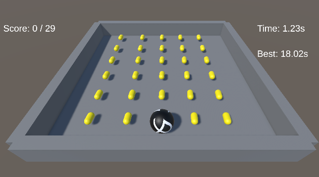

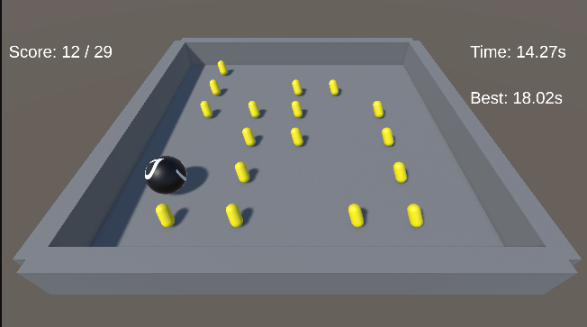

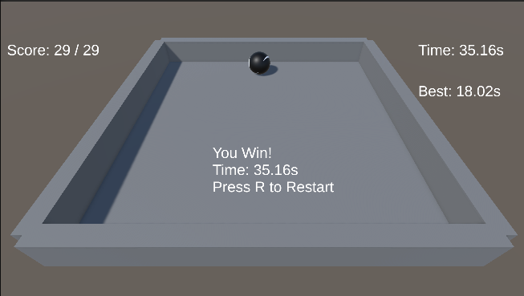