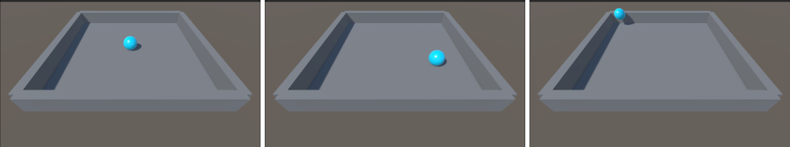

This Lab 3 follows the Unity Learn Roll-a-ball workflow (Unity 6.3) and delivers a runnable minimal rolling-ball scene: I set up the ground and player sphere in a URP 3D project, configured lighting and materials, and implemented physics-based movement using a Rigidbody together with the new Input System (Player Input).  
On top of the tutorial baseline, I added surrounding walls to constrain the play area, and adjusted the camera angle and distance to make the gameplay view more stable and readable.

## 1. Project Creation and Scene Initialization (URP)

A new project was created in Unity Hub using the **Universal 3D (URP)** template, with Unity version **6000.3.2f1 (LTS)**.


After opening the Editor, I created and saved a new scene (`MiniGame`, stored under `Assets/Scenes`). All subsequent objects and scripts were built and tested within this scene.

## 2. Scene Setup: Ground and Boundary Structure

### 2.1 Ground

I created a Plane and renamed it to `Ground`, then reset its Transform to place it at the origin. To enlarge the playable area, I set the Ground scale to **X=2, Z=2** (keeping Y at its default).


### 2.2 Walls (Extra)

I placed four Cubes (`Cube1`–`Cube4`) around the ground as boundaries, forming a closed arena to prevent the ball from rolling out of the playable area. The walls keep the default Box Collider, so they collide properly with the player sphere.

The following figure shows how the wall objects are organized in the Hierarchy (Cube1–Cube4 in the same scene as Ground/Player):


One wall (example: `Cube1`) uses the following parameters: Position **(10, 1, 0)** and Scale **(1, 2, 20)**. The other three walls are obtained through symmetric placement/rotation to ensure the arena is fully enclosed.


## 3. Player (Sphere) and Material Appearance

I created a Sphere and renamed it to `Player`. To keep the enlarged sphere sitting correctly on the ground, I set its scale to **(2, 2, 2)** and set its Position **Y=1** (radius = 1). This ensures the bottom of the sphere touches the ground and the setup remains visually stable.


## 4. Lighting and Materials

To improve visual clarity, I created two materials and applied them to the scene:

- `Background` (Ground): light gray, **RGB 130/130/130**, Metallic=0, Smoothness≈0.25 (matte surface to reduce distracting reflections)
- `Player` (Sphere): light blue, **RGB 0/220/255**, Metallic=0, Smoothness≈0.75 (brighter and easier to track)

I also changed the Directional Light color to pure white (RGB 255/255/255) and set a more contrastive rotation (e.g., X=50, Y=50, Z=0), so the ball’s shadow changes are visible during rolling and collisions.


## 5. Movement Control: Rigidbody + Player Input + PlayerController

### 5.1 Component Setup

To drive the ball using physics, I added the following to `Player`:

- **Rigidbody**
- **Player Input** (new Input System)
- A custom script **PlayerController** (stored under `Assets/Scripts`)


### 5.2 Control Logic

The control logic is:

- `OnMove(InputValue ...)` receives the 2D movement input (X/Y) from the Input System and stores it;
- `FixedUpdate()` (physics step) builds a 3D movement vector `(movementX, 0, movementY)`;
- `rb.AddForce(movement * speed)` applies force to the Rigidbody, resulting in a rolling-ball behavior;
- `speed` is exposed as a public parameter and set to **10** in the Inspector to achieve a reasonable movement speed.

Full code:

```csharp
using System.Collections;
using System.Collections.Generic;
using Unity.VisualScripting;
using UnityEngine;
using UnityEngine.InputSystem;
public class PlayerController : MonoBehaviour
{
    private Rigidbody rb;
    private float movementX;
    private float movementY;
    public float speed = 0;
    void Start()
    {
        rb = GetComponent<Rigidbody>();
    }
    void OnMove(InputValue movementValue)
    {
        Vector2 movementVector = movementValue.Get<Vector2>();
        movementX = movementVector.x;
        movementY = movementVector.y;
    }

    private void FixedUpdate()
    {
        Vector3 movement = new Vector3(movementX, 0.0f, movementY);
        rb.AddForce(movement * speed);
    }
}
```

## 6. Results and Validation

In Play Mode, the sphere responds to input, rolls across the ground, and collides with the surrounding walls without leaving the arena. The figure below shows the ball at different positions (including near-wall behavior), confirming that both the boundary setup and physics movement work as intended.



## 8. Summary

This Lab 3 completes the core Roll-a-ball loop: **controllable physics-based movement + clear visual presentation**. By adding walls and refining the camera setup on top of the tutorial baseline, the play area becomes more explicit and the gameplay remains stable, providing a solid base for further extensions.