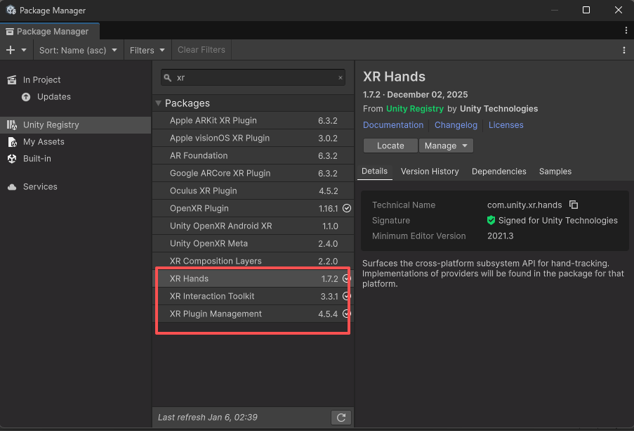
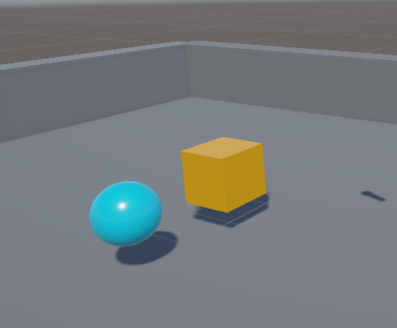
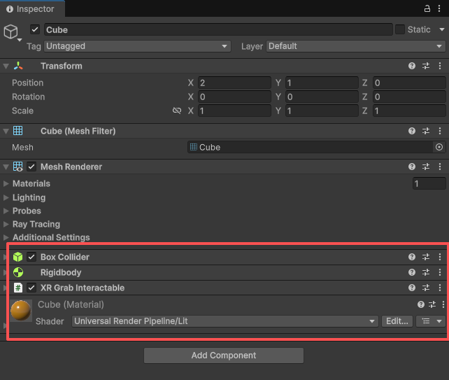
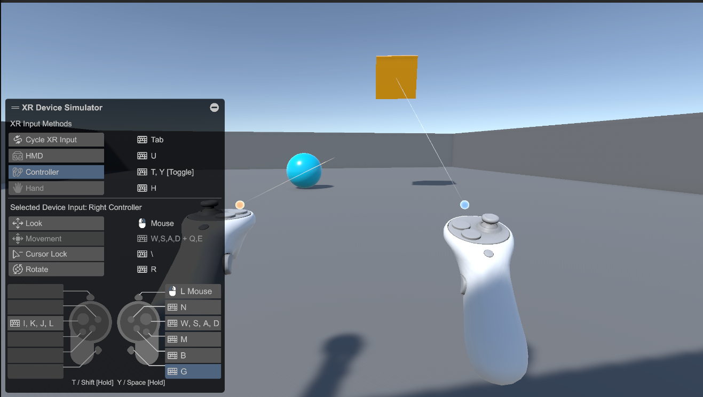
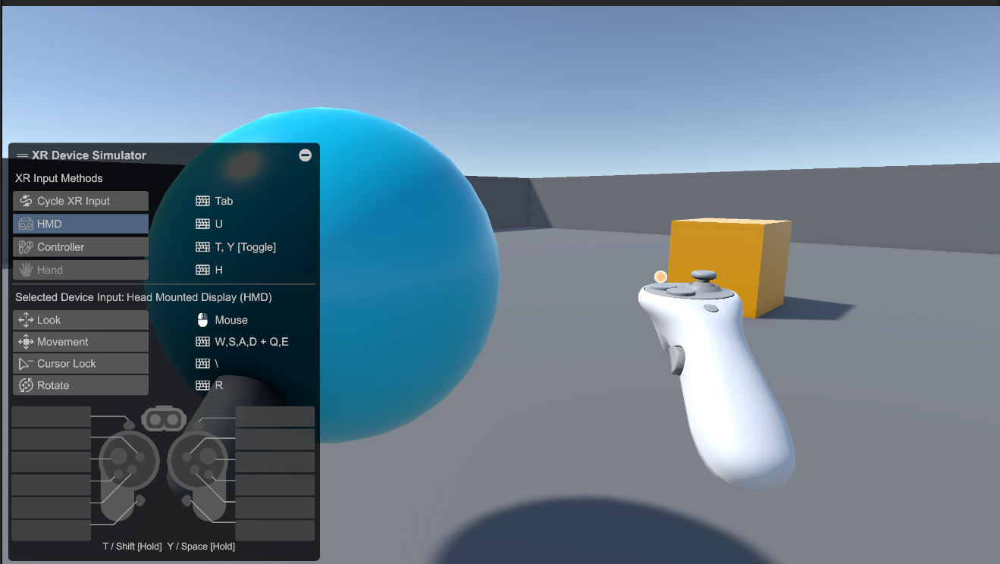

This Lab 4 aims to migrate the Lab 3 Roll-a-ball scene into a VR interaction framework and implement two fundamental selection techniques: **direct selection (near-field grabbing)** and **raycasting (far-field ray selection)**. What I completed so far includes: enabling XR support for the project and setting up a runnable VR interaction baseline; removing the original keyboard-driven rolling control for the ball and switching to XR-based object manipulation; adding an interactive Cube and configuring XR-related components for both the sphere and the Cube, so that they can be selected and moved using a ray, or grabbed directly when approached.

> Note: This implementation focuses on “VR Roll-a-ball + two selection techniques.” Game mechanics such as collecting items and scoring can be added on top of this later.

---

## 1. Approach

I prioritized getting a stable VR environment first, then kept the interactive targets minimal (sphere + Cube) to validate the XR interaction loop end-to-end: entering the scene correctly in VR/simulation mode, seeing hands/rays, selecting objects, and moving/grabbing them reliably. Keeping the scope small makes debugging straightforward. if something fails, it is usually traceable to XR configuration or missing interaction components, rather than being obscured by additional gameplay logic.

---

## 2. Migrating from Lab 3 to VR: XR setup and simulation

This lab uses Unity 6.3 with the XR Interaction Toolkit. The key is enabling the XR pipeline and relying on the new Input System-based interaction stack. In Package Manager, I switched the source to **Unity Registry** and ensured that the XR-related packages were installed (XR Plugin Management, XR Interaction Toolkit, XR Hands).

 I used the **XR Device Simulator** provided by the XR Interaction Toolkit to simulate head and controller inputs. This is essential for development without a headset: it allows testing XR interactions entirely with keyboard/mouse, especially during the setup and configuration stage. After adding XR interaction objects (XR Origin / XR Interaction Setup) and the XR Device Simulator to the scene, I was able to test both ray-based selection and direct grabbing in Play Mode without relying on any physical device.

---

## 3. Scene and object adjustments: from “rolling control” to “XR manipulation”

In Lab 3, the ball movement was driven by `Rigidbody + AddForce`, using keyboard input. In the VR version, keeping this control scheme creates conflicts: VR input comes from XR actions (controller/simulator), and the lab’s core goal is to validate direct and ray selection. Continuous keyboard force can interfere with grab/drag behavior and lead to unstable physics or unclear interaction feedback. Therefore, I removed the original ball controller script so that the sphere is no longer a keyboard-controlled player avatar, but instead becomes one of the interactable objects in the scene.

To better observe selection and grabbing behavior, I added a Cube (and placed objects around the playable area). This makes it easier to test ray hit stability at different distances, confirm that direct grabbing requires proximity as expected, and check whether multiple interactables in view lead to accidental selection—useful context for later disambiguation extensions.

---

## 4. Implementing the two selection techniques: Raycasting and Direct Selection

To make an object “nteractable in the XR system, I followed a simple and reliable checklist: **Collider + Rigidbody + XR Grab Interactable**. The Collider enables hit/contact detection, the Rigidbody lets physics handle the object during interaction, and `XR Grab Interactable` registers the object into the XR interaction framework so that it can be selected by Interactors (either ray-based or direct hand-based). I applied the same interaction configuration to both the sphere and the Cube so they support both selection modes.

With this baseline, **Raycasting** provides a “point and select” experience suitable for far-field interaction. It relies on a Ray Interactor (typically included in the XR Origin preset). In Play Mode, aiming the ray at the Cube or the sphere and being able to select and move/drag it confirms that ray-based interaction works.

**Direct Selection** matches real-world “reach and grab” behavior and requires physical proximity (or simulator-driven proximity). It relies on a Direct Interactor (also typically included in the XR Origin setup). When the hand/controller enters the interactable range, direct grabbing and moving the object confirms that near-field selection is correctly configured.

In my current scene, both interaction modes work reliably: I can use the ray to select from a distance and switch naturally to direct grabbing when I move closer, without obvious conflicts.

---

## 5. Issues encountered and how I fixed them

The main issue I encountered was that some objects could not be grabbed. The root cause was that they were missing the `XR Grab Interactable` component. In the XR interaction system, having only a Rigidbody and Collider does not automatically make an object grabbable, you must explicitly mark it as interactable. After adding `XR Grab Interactable` and re-checking Collider/Rigidbody status, both the sphere and the Cube became consistently selectable and grabbable.

---

## 6. Possible extensions

A natural next step is to add interaction feedback. for example, a subtle sound or visual cue at the moment of selection/grab to make state changes more explicit. Another meaningful direction is handling accidental selection and disambiguation when multiple objects are close together (progressive refinement). Finally, it would be interesting to compare with an alternative selection technique such as Go-Go. All of these can be built on top of the current XR setup without refactoring the core interaction structure.

---

## 7. Summary

The core goal of Lab 4 is to move the Lab 3 Roll-a-ball scene into an XR interaction framework and validate two common selection techniques. At this stage, I have enabled VR support and simulation without hardware, and configured the sphere and Cube as interactable objects that support both raycasting and direct selection reliably. This provides a solid base for extending the project with gameplay goals and richer VR interaction feedback.

 

 