This Lab 4 focuses on migrating the Lab 3 Roll-a-ball project into a Quest (VR) environment, and implementing two fundamental (and most commonly used) selection techniques: **Direct Selection (near-field grabbing)** and **Raycasting (far-field ray selection)**.  
In the end, I built it as a small “tabletop game”: Roll-a-ball is scaled down into a tray/board placed on a table. I can grab the whole board with the controllers, move it around, and drop it. I can also use a right-hand ray to select and grab the board from a distance, while still letting the ball roll inside, collect pickups, and keep the UI readable in VR.

---

## A. Export a unitypackage from Lab3

Instead of modifying the Lab3 project directly into VR, I first exported Lab3 as a content package and then rebuilt Lab4 in a clean new project. This keeps dependencies cleaner and makes conflicts easier to locate.

1. Open the **Lab3 project**
2. In the Project window, select `Assets` → `Assets > Export Package...`
3. Check **Include dependencies** → export as `RollABall_Lab3.unitypackage`

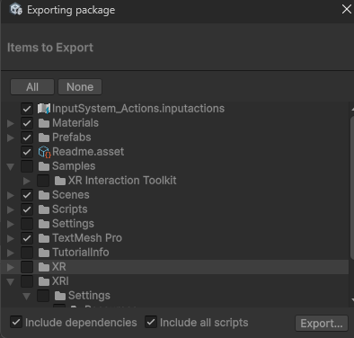

---

## B. Create a new Lab4 VR project

### B1) Create a new project

Unity Hub → create a **3D** project (I named it `RollABallVR`)

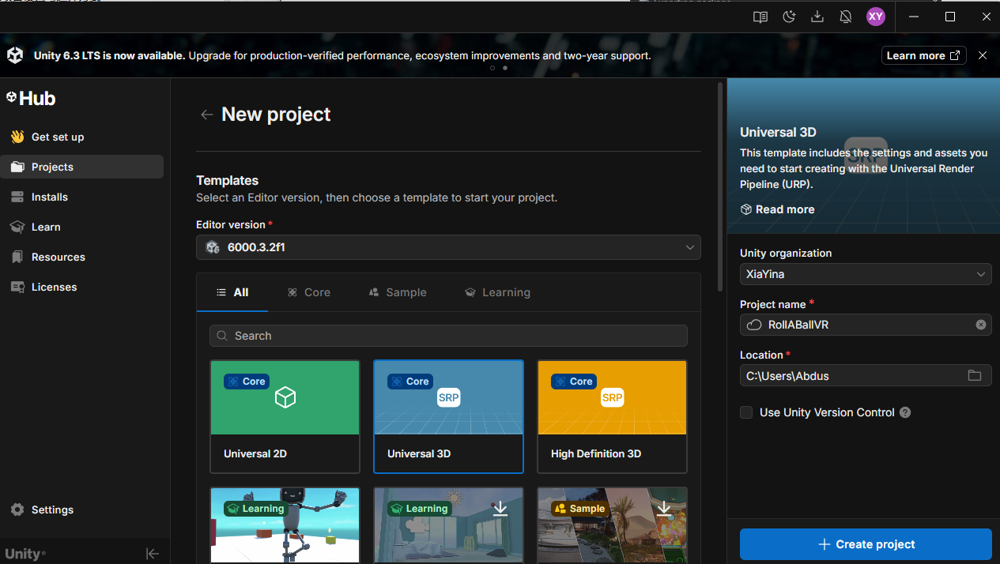

### B2) Switch to the Quest platform (Android)

`File > Build Profile...` → choose **Android** → `Switch Platform`

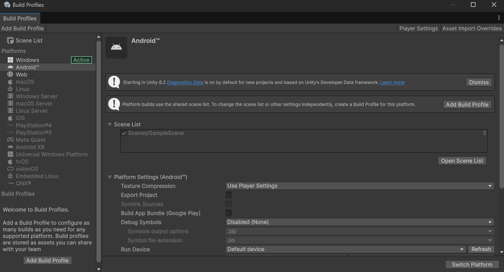

### B3) Import Meta All-in-one SDK

Search **Meta XR All-in-one SDK** in the Asset Store, download it, and import it into the project.  
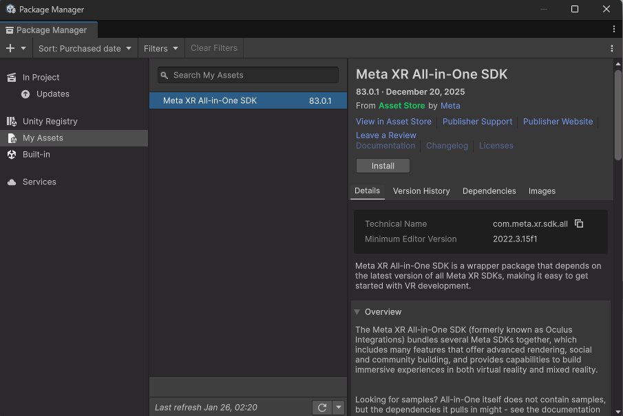

### B4) Install XR Plugin Management and check MetaXR status

`Edit > Project Settings` → install/enable **XR Plug-in Management**.  
Then in `Project Settings > XR Plug-in Management`, confirm that MetaXR / Oculus-related options are available and enabled.

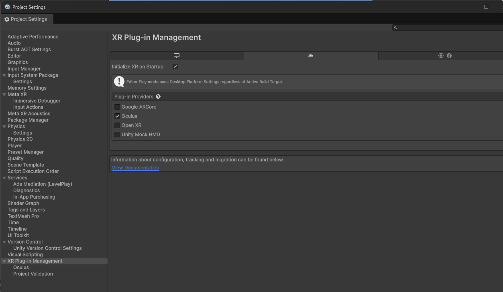

---

## C. Import Roll-a-ball (and fix script conflicts)

### C1) Import the unitypackage

`Assets > Import Package > Custom Package...` → select `RollABall_Lab3.unitypackage` exported earlier.

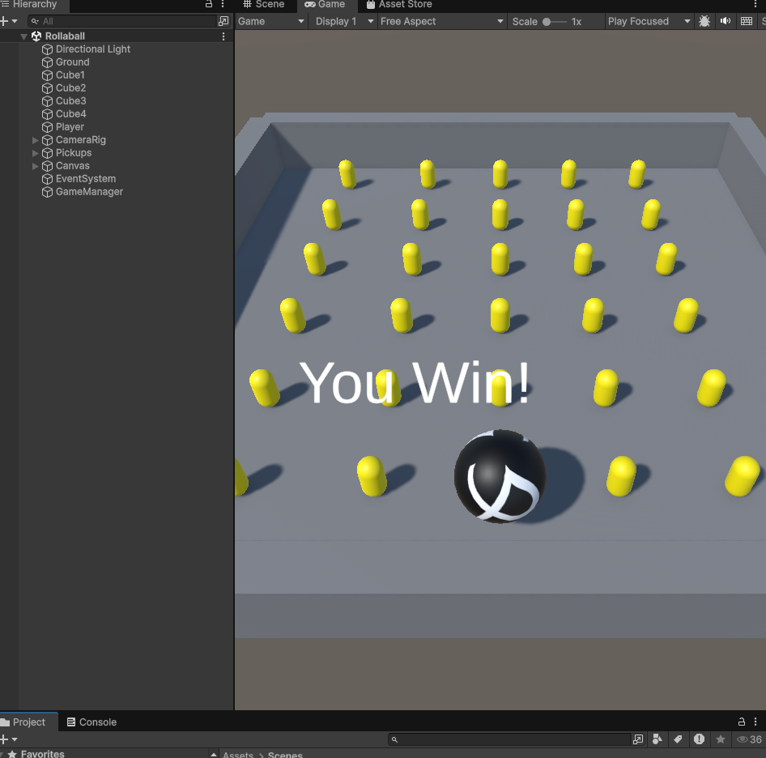

### C2) Resolve the PlayerController naming conflict + switch input

The most common issue after importing is that Oculus/Meta SDK also contains a script named `PlayerController`, which conflicts with Lab3’s `PlayerController.cs`.  
Also, Lab4’s selection interaction uses `OVRInput` (controller input), not the Lab3 Input System code. So I switched the ball movement script to an OVRInput version.

What I did:

1. Rename `PlayerController.cs` (to `BallControllerOVR.cs`)
2. If the ball (Player) has components like `Player Input`, remove/disable them (to avoid mixing input systems)
3. Replace with the following **OVRInput-based ball movement script**

Keep the script file name and class name consistent (`BallControllerOVR.cs` / `BallControllerOVR`), then attach it to `Player`:

```c#
using UnityEngine;

public class BallControllerOVR : MonoBehaviour
{
    public float speed = 10f;
    private Rigidbody rb;

    void Start()
    {
        rb = GetComponent<Rigidbody>();
    }

    void FixedUpdate()
    {
        // Left stick: PrimaryThumbstick (default)
        Vector2 stick = OVRInput.Get(OVRInput.Axis2D.PrimaryThumbstick);

        Vector3 movement = new Vector3(stick.x, 0f, stick.y);
        rb.AddForce(movement * speed);
    }
}
```

---

## D. Build a “tabletop Roll-a-ball” demo scene

Instead of dropping the VR rig into the Lab3 scene, I created a dedicated Lab4 scene: first set up a VR “standing space” and a table, then scale Roll-a-ball down onto the tabletop.

1. Create a new Scene (e.g., `RollABallVR.unity`)
2. Delete the default `Main Camera` (we will use OVRCameraRig)
3. Create a **large floor** (for standing in VR)
4. Create a **Cube as the table**
5. Create an empty object `Environment` and group all non-interactive objects under it (floor, table, etc.)

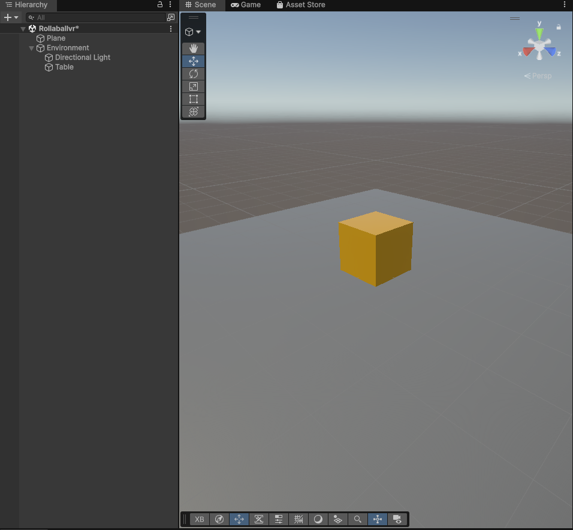

---

## E. Add VR rig and controllers (Building Blocks)

I used the Meta SDK Building Blocks here, since it is beginner-friendly: it can generate the camera rig, controller tracking, and the basic structure with minimal setup.

1. `Meta XR Tools > Building Blocks` → Add **OVRCameraRig**
2. Add **Controller Tracking** (one for the left hand, one for the right hand)

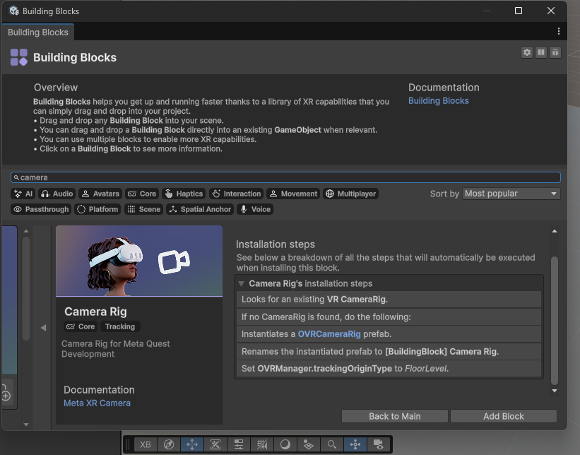

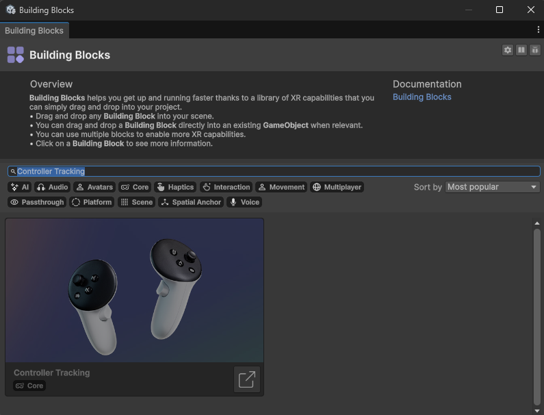

---

## F. Place Lab3 Roll-a-ball on the table (and set UI to World Space)

### F1) Use a root node to group the whole mini-game

I created an empty object `RollABallRoot`, representing “the whole board on the table”. All selection/grabbing is done on `RollABallRoot`.

1. Create an empty object above the table: `RollABallRoot`
2. Move `Player / Ground / Walls / Pickups / Canvas(UI) / GameManager` under `RollABallRoot` as children
3. Scale the whole set down to tabletop size

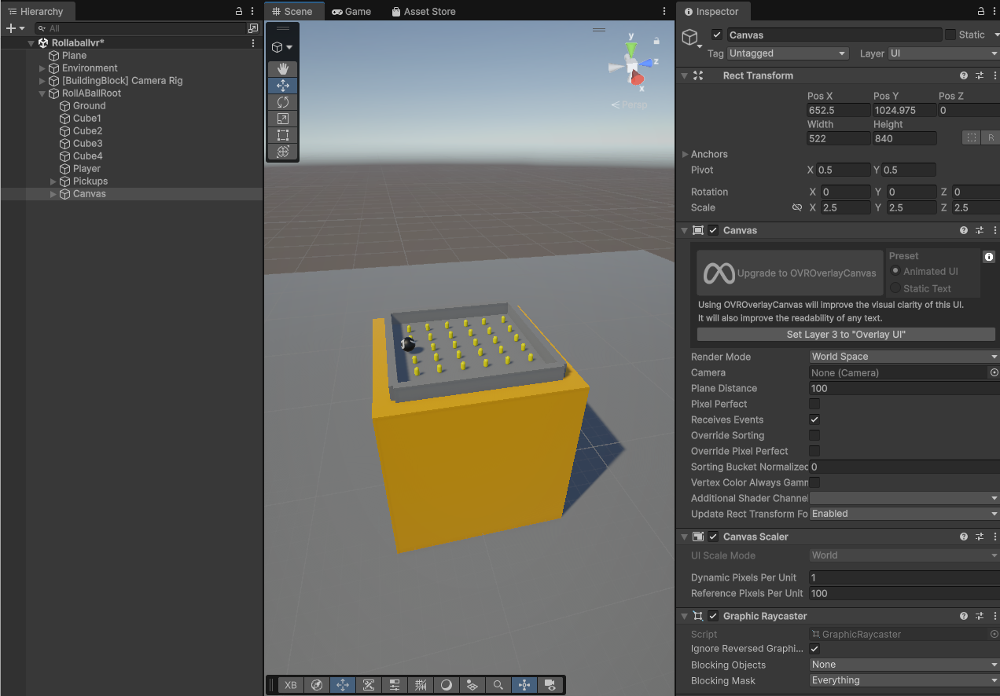

### F2) Make Ground’s MeshCollider stable after scaling

Select `Ground`. If it uses a MeshCollider, check **Convex**.

### F3) Turn the UI into a “3D object in the scene”

I set the Canvas Render Mode to **World Space**. This makes the text behave like a real 3D panel above the board, instead of a flat screen UI that can look distorted in VR.

---

## G. Direct Selection (near-field grabbing the board)

The idea of Direct Selection is straightforward: when the controller is close to the board, hold the index trigger to grab it; release the trigger to drop it.  
Implementation-wise, I did not use XR Interaction Toolkit’s Interactable system. Instead, following the course PDF approach, I used Unity Collider/Trigger + parenting: when grabbed, `RollABallRoot` becomes a child of the hand; when released, I detach it and apply the controller’s velocity/angular velocity to simulate a “throw”.

### G1) Create Layers to separate “game physics” from “selection”

This is easy to miss but extremely important. Since hands/controllers also have colliders, without proper layer separation they may collide with the ball, push pickups, and mess up physics.

I created two Layers:

- `roll-a-ball`: ball, ground, walls, pickups (the internal game objects)
- `selection`: the board root `RollABallRoot` and the left/right hand anchors

Path: `Edit > Project Settings... > Tags and Layers`

### G2) Configure the Physics Layer Collision Matrix

`Edit > Project Settings... > Physics` → find the Layer Collision Matrix and set it like this:

- Keep `roll-a-ball` colliding with `roll-a-ball` (normal internal physics)
- Disable collisions between `selection` and `roll-a-ball` (hand triggers should not push the ball or trigger pickups)

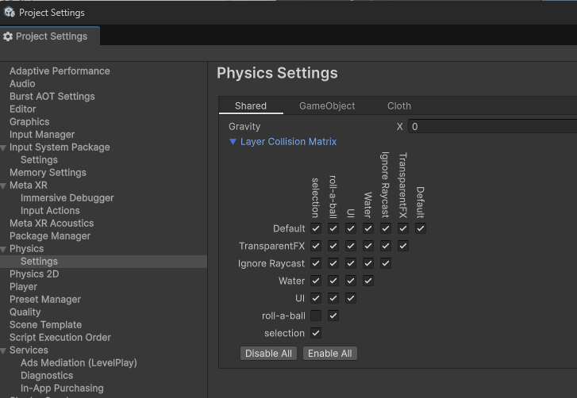

### G3) Add Trigger colliders to hands (for proximity detection)

On both `LeftHandAnchor` and `RightHandAnchor`, I added a `Sphere Collider`:

- Check `Is Trigger`
- Radius around `0.12 ~ 0.18` (I started with about 0.15 and adjusted later)

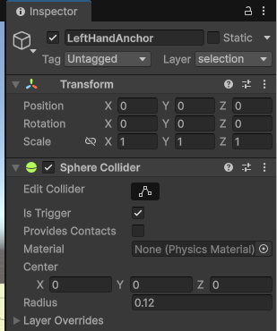

### G4) Add a BoxCollider to RollABallRoot (as the selectable target)

Select `RollABallRoot`, add a `Box Collider`, then click `Edit Collider` and resize it to tightly cover the board area (usually covering the Ground region is enough).

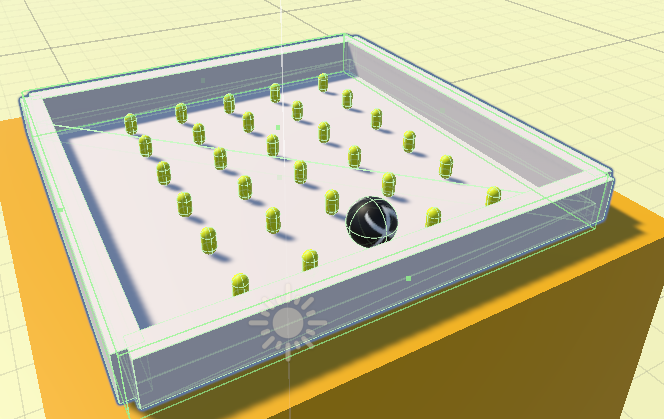

### G5) Add Rigidbodies to hands and the board (for stable grab/release)

- `LeftHandAnchor` / `RightHandAnchor`:
  - Add `Rigidbody`
  - Turn off `Use Gravity`
  - Turn on `Is Kinematic`

- `RollABallRoot`:
  - Add `Rigidbody`
  - Turn on `Use Gravity` (so it falls back onto the table after release)
  - Keep `Is Kinematic` off (default)
  - Start with Mass 1~5 and adjust by feel

### G6) Write the near-field grab script

I wrote a script `MySelect.cs` and attached it to both hand anchors.  
In short, it does the following:

- When the hand trigger enters the board BoxCollider, set `inRange = true`
- When the index trigger passes a threshold, Grab
- On Grab, parent the board to the hand and set the board Rigidbody to kinematic (to avoid jitter)
- On Release, detach, restore physics, and apply OVRInput tracked velocity/angular velocity to simulate throwing
- Use a static variable to prevent both hands grabbing at the same time

Script:

```c#
using UnityEngine;

public class MySelect : MonoBehaviour
{
    [Header("Assign in Inspector")]
    public Transform rollABallRoot;
    public Rigidbody rollABallRigidbody;

    [Header("Which controller is this hand?")]
    public OVRInput.Controller controller = OVRInput.Controller.LTouch;

    [Header("Grab settings")]
    public float grabThreshold = 0.55f;

    private bool inRange = false;
    private bool grabbed = false;
    private Transform originalParent;

    // prevent two hands grabbing at the same time
    private static MySelect activeGrabber = null;

    void Update()
    {
        float trigger = OVRInput.Get(OVRInput.Axis1D.PrimaryIndexTrigger, controller);
        bool triggerDown = trigger >= grabThreshold;

        // Grab
        if (!grabbed && inRange && activeGrabber == null && triggerDown)
        {
            Grab();
        }

        // Release
        if (grabbed && activeGrabber == this && !triggerDown)
        {
            Release();
        }
    }

    void Grab()
    {
        activeGrabber = this;
        grabbed = true;

        originalParent = rollABallRoot.parent;

        // parent to hand so it follows
        rollABallRigidbody.isKinematic = true;
        rollABallRigidbody.useGravity = false;
        rollABallRoot.SetParent(transform, true);
    }

    void Release()
    {
        // detach
        rollABallRoot.SetParent(originalParent, true);

        rollABallRigidbody.isKinematic = false;
        rollABallRigidbody.useGravity = true;

        // throw with tracked velocity
        Vector3 v = OVRInput.GetLocalControllerVelocity(controller);
        Vector3 w = OVRInput.GetLocalControllerAngularVelocity(controller);

        rollABallRigidbody.velocity = v;
        rollABallRigidbody.angularVelocity = w;

        grabbed = false;
        activeGrabber = null;
    }

    private void OnTriggerEnter(Collider other)
    {
        if (other.transform == rollABallRoot) inRange = true;
    }

    private void OnTriggerExit(Collider other)
    {
        if (other.transform == rollABallRoot) inRange = false;
    }
}
```

### G7) Attach the script to both hands and set Inspector references

This part is critical: even with correct code, if Inspector references are not assigned, nothing will work.

- Left hand: add `MySelect` to `LeftHandAnchor`
  - `Roll ABall Root`: drag `RollABallRoot`
  - `Roll ABall Rigidbody`: drag the Rigidbody on `RollABallRoot`
  - `Controller`: `L Touch`

- Right hand: add `MySelect` to `RightHandAnchor`
  - `Controller`: `R Touch`

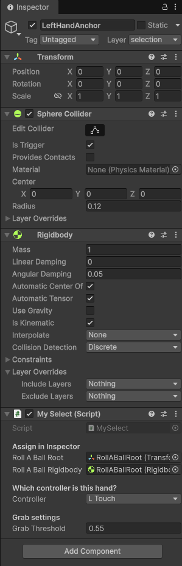

### G8) Test near-field grabbing

In Play Mode:

1. Move the hand close to the board (enter the trigger range)
2. Hold the index trigger: the board “snaps” to the hand and follows
3. Release the trigger: the board drops; if you swing your hand, it carries velocity

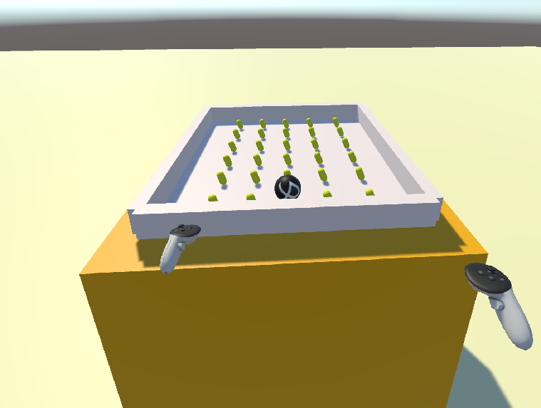

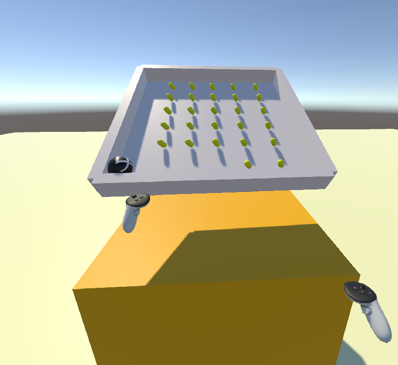

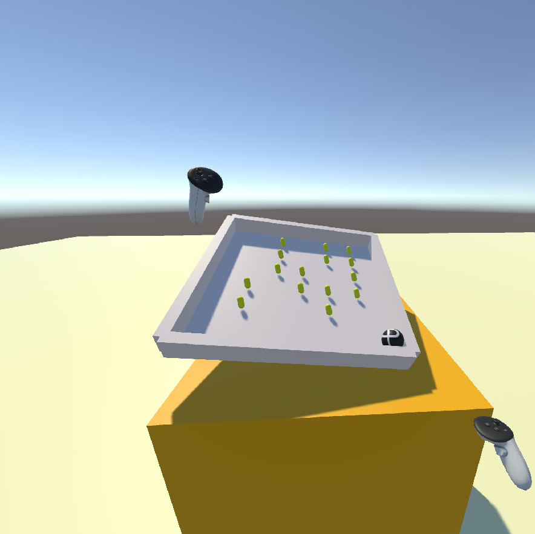

---

## H. Raycasting

After near-field grabbing worked, I added the second technique: a right-hand ray.  
I kept the same grab/release logic and only extended the “can grab” condition from `inRange` to: `inRange or rayHitTarget`.

### H1) Visualize the ray with LineRenderer

On `RightHandAnchor`, I added a `Line Renderer`.  
To make the ray visible in VR, I assigned a blue material and set the line width to something readable (around 0.008).

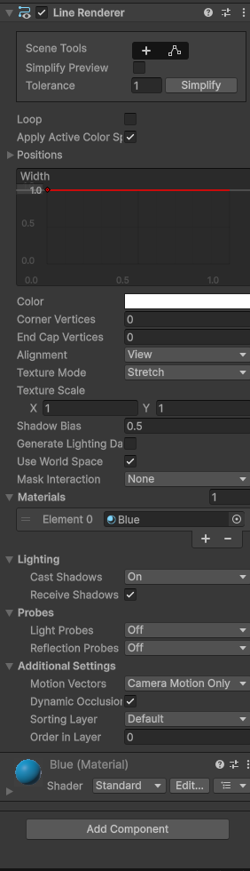

### H2) Replace MySelect.cs with a Raycasting-supported version

I added these fields to the script:

- `enableRay`: whether to enable the ray (only enabled on the right hand)
- `rayLength`: ray length
- `rayMask`: detect only the `selection` layer (avoid hitting the ball/walls inside the game)
- `line`: LineRenderer reference (for drawing the ray)

Code:

```c#
using UnityEngine;

public class MySelect : MonoBehaviour
{
    [Header("Assign in Inspector")]
    public Transform rollABallRoot;
    public Rigidbody rollABallRigidbody;

    [Header("Which controller is this hand?")]
    public OVRInput.Controller controller = OVRInput.Controller.LTouch;

    [Header("Grab settings")]
    public float grabThreshold = 0.55f;

    [Header("Raycasting (far selection)")]
    public bool enableRay = false;
    public float rayLength = 5.0f;
    public LayerMask rayMask;         // set to Selection layer only
    public LineRenderer line;         // drag the LineRenderer here
    public float lineWidth = 0.008f;  // make it visible in Unity 6

    private bool inRange = false;
    private bool grabbed = false;
    private Transform originalParent;

    private static MySelect activeGrabber = null;

    void Update()
    {
        float trigger = OVRInput.Get(OVRInput.Axis1D.PrimaryIndexTrigger, controller);
        bool triggerDown = trigger >= grabThreshold;

        bool rayHitTarget = false;
        if (enableRay)
            rayHitTarget = UpdateRayAndCheckHit();

        bool canGrab = (inRange || rayHitTarget) && activeGrabber == null;

        if (!grabbed && canGrab && triggerDown)
            Grab();

        if (grabbed && activeGrabber == this && !triggerDown)
            Release();
    }

    bool UpdateRayAndCheckHit()
    {
        Vector3 origin = transform.position;
        Vector3 dir = transform.forward;

        float endDist = rayLength;
        bool hitTarget = false;

        if (Physics.Raycast(origin, dir, out RaycastHit hit, rayLength, rayMask, QueryTriggerInteraction.Collide))
        {
            if (rollABallRoot != null && (hit.transform == rollABallRoot || hit.transform.IsChildOf(rollABallRoot)))
            {
                hitTarget = true;
                endDist = hit.distance;
            }
        }

        if (line != null)
        {
            line.startWidth = lineWidth;
            line.endWidth = lineWidth;
            line.positionCount = 2;
            line.useWorldSpace = true;

            line.SetPosition(0, origin);
            line.SetPosition(1, origin + dir * endDist);
        }

        return hitTarget;
    }

    void Grab()
    {
        if (rollABallRoot == null || rollABallRigidbody == null) return;

        activeGrabber = this;
        grabbed = true;

        originalParent = rollABallRoot.parent;

        rollABallRigidbody.isKinematic = true;
        rollABallRigidbody.useGravity = false;
        rollABallRoot.SetParent(transform, true);
    }

    void Release()
    {
        rollABallRoot.SetParent(originalParent, true);

        rollABallRigidbody.isKinematic = false;
        rollABallRigidbody.useGravity = true;

        Vector3 v = OVRInput.GetLocalControllerVelocity(controller);
        Vector3 w = OVRInput.GetLocalControllerAngularVelocity(controller);

        rollABallRigidbody.velocity = v;
        rollABallRigidbody.angularVelocity = w;

        grabbed = false;
        activeGrabber = null;
    }

    private void OnTriggerEnter(Collider other)
    {
        if (other.transform == rollABallRoot) inRange = true;
    }

    private void OnTriggerExit(Collider other)
    {
        if (other.transform == rollABallRoot) inRange = false;
    }
}
```

### H3) Enable the ray only on the right hand, and set Ray Mask correctly

Select `RightHandAnchor` → `MySelect` component:

1. `Controller`: `R Touch`
2. Check `Enable Ray`
3. `Ray Length`: 5 (enough for a tabletop distance)
4. `Ray Mask`: check only `selection` (nothing else)
5. `Line`: drag the `Line Renderer` on RightHandAnchor into this field
6. `Line Width`: 0.008

In Play Mode, we can see a ray aligned with the right hand forward direction. Aim at the board and hold the index trigger to grab it from a distance. Release to drop it, and swinging the right hand will transfer velocity.

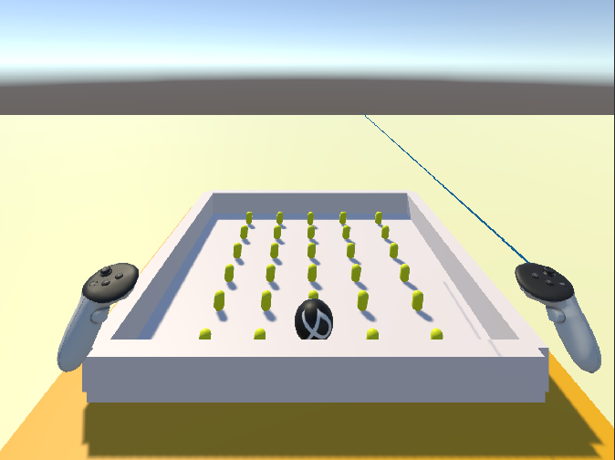


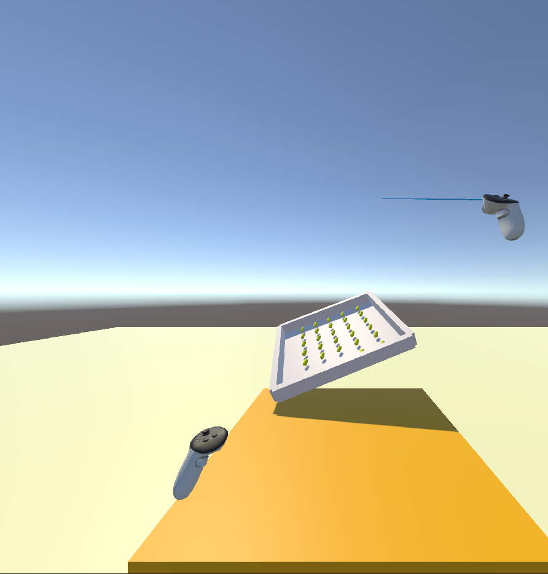

---

## I. Rebuild the HUD: keep UI always in front of the view

At first, I used a World Space UI above the board, which feels natural and readable, like a real panel on the tabletop.  
However, in VR we often lift, tilt, or move the board, and the UI can easily leave the view or face away from the camera. To make the experience more stable, I later rebuilt the UI as a “head-locked HUD” that follows the head and stays fixed in front of the view.

My setup was straightforward: create a `HUDAnchor` under `CenterEyeAnchor`, place a World Space Canvas under it, put `ScoreText / TimerText / BestText / WinText` under that Canvas, and then reassign those four TMP Text references in `GameManager`.

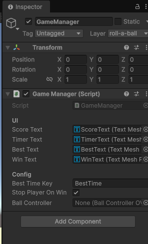

---

## J. Final result and gameplay validation

At this point, the VR Roll-a-ball forms a complete loop:

- I can grab the board, change its pose, and let the ball roll via gravity/collisions
- The ball scores by touching pickups
- After collecting all pickups, a win message and completion time are shown

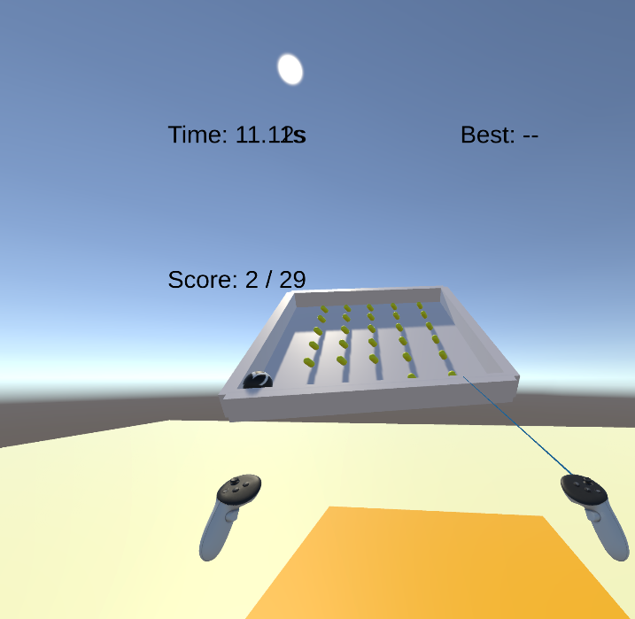

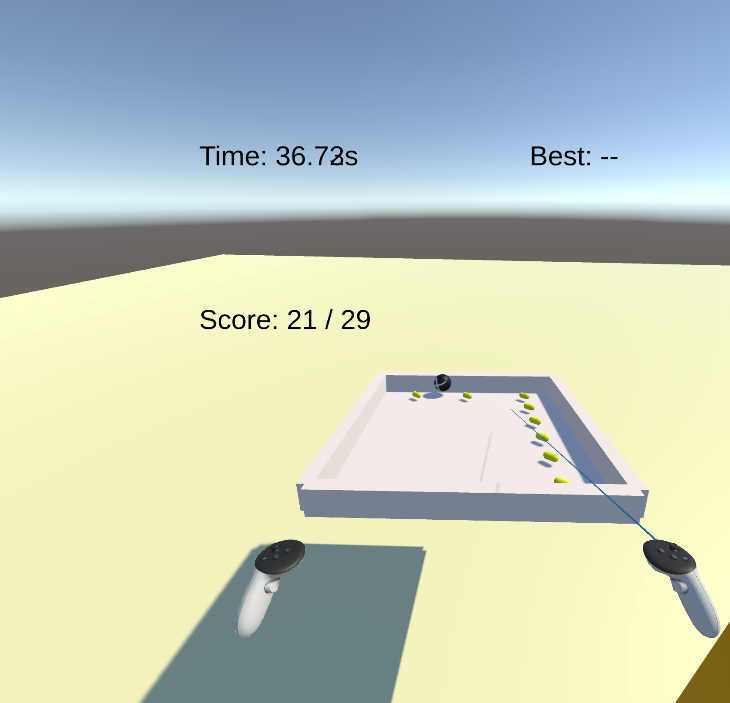

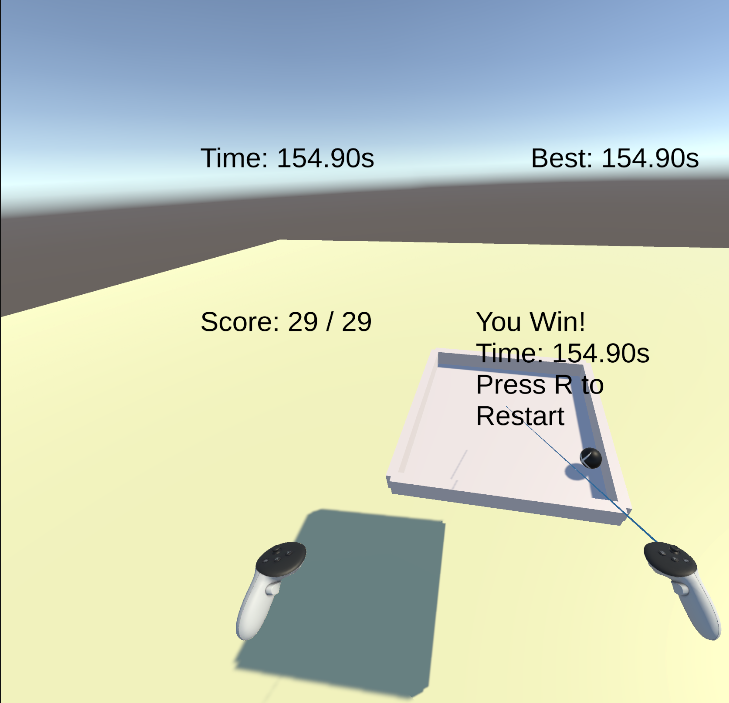

---

## K. Summary

My biggest takeaway from Lab 4 was getting the most basic VR interaction structure working end-to-end:

- Direct Selection is essentially: use triggers to detect “close enough”, parent the object to the controller while grabbing, and apply controller motion when releasing.
- Raycasting adds a “far-field hit condition” on top of the same logic, so we can select without being close.
- Using Layers + the Physics Collision Matrix to separate the selection system from the internal game physics is the key to avoiding many strange collision/physics issues.
