This post documents the full implementation process of IGD301 Lab Homework 5: taking my locomotion concept from previous assignments and turning it into a working Unity system inside the course-provided parkour scene.

For this lab, all core gameplay locomotion behavior is centralized in `LocomotionTechnique.cs`, including movement gating, arm-swing power detection, speed mapping, jump, respawn, stage triggers, and coin collection.

---

## 1. Goals and Scene Constraints

This assignment is not a generic locomotion demo. It has to work in the official parkour route, which immediately imposes three constraints:

- Dense curves, so direction control must stay responsive
- Frequent acceleration/deceleration, so stopping intent must be explicit
- Floating coins near the end, so vertical movement (jump) is required

 

 


If the system only supports flat forward motion without speed gating or jump, the final route segment fails by design. That is why the implementation has to cover a complete state chain: start, cruise, stop, jump, and respawn.

---

## 2. Final Interaction Design

The final interaction can be summarized in four rules:

- Hold either index trigger to engage locomotion
- Estimate `swingPower` from two-hand arm swing speed, then map it to forward speed
- Use HMD horizontal forward direction as movement direction
- Press `A` for a short jump, press `B/Y` to respawn to the current checkpoint

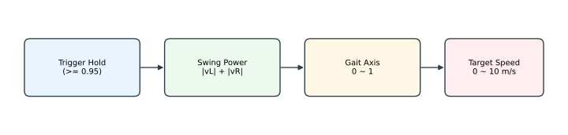

The focus of this design is control quality rather than raw top speed: clear engage gating, immediate deceleration after release, and enough precision for coin pickup around curved segments.

---

## 3. Component Setup and Scene Binding

### 3.1 Attach the Locomotion Script

I attached `LocomotionTechnique` to the player physics object (with `Rigidbody` + `CapsuleCollider`) and assigned the required inspector references:

- `ovrRig`, `trackingSpace`, `centerEyeAnchor`
- `leftController` / `rightController`
- `hmd`
- `parkourCounter`

| 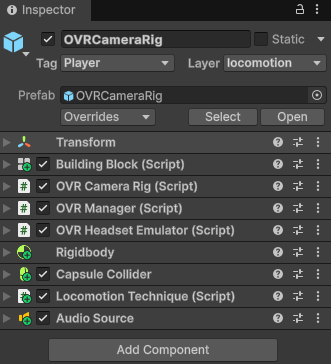 | 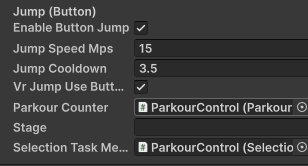 |
| --- | --- |

### 3.2 Rigidbody Movement Configuration

In `Start()`, the script auto-configures Rigidbody with these key settings:

- `isKinematic = false`
- `useGravity = true`
- `interpolation = Interpolate`
- `collisionDetectionMode = ContinuousDynamic`
- `FreezeRotation`

```c#
void Start()
{
    prevUpdateTime = Time.time;

    if (autoConfigureRigidbody && rb != null)
    {
        rb.isKinematic = false;
        rb.useGravity = enableGravity;
        rb.interpolation = RigidbodyInterpolation.Interpolate;
        rb.collisionDetectionMode = CollisionDetectionMode.ContinuousDynamic;
        rb.constraints = RigidbodyConstraints.FreezeRotation;
    }

    ResetPowerState(true);
}
```

`FreezeRotation` is especially important. Without it, collision responses can roll the player body and break directional consistency, which noticeably hurts comfort.

---

## 4. Hold-to-Engage: Explicit Movement Intent

I implemented the outer gating layer first, before arm-swing itself. The reason is practical: hands move naturally in VR, and without gating the system can misinterpret incidental hand motion as locomotion intent.

Core logic (from `Update()`):

```csharp
leftTriggerValue = OVRInput.Get(OVRInput.Axis1D.PrimaryIndexTrigger, leftController);
rightTriggerValue = OVRInput.Get(OVRInput.Axis1D.PrimaryIndexTrigger, rightController);
leftTriggerHeld = leftTriggerValue > triggerHoldThreshold;
rightTriggerHeld = rightTriggerValue > triggerHoldThreshold;

bool vrEngaged = leftTriggerHeld || rightTriggerHeld;
isIndexTriggerDown = vrEngaged;
```

Default threshold is `triggerHoldThreshold = 0.95f`. This filters accidental light touches and requires clear movement intent from the user.

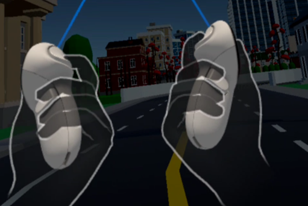

---

## 5. Arm-Swing Signal Modeling: Controller Motion to `swingPower`

This is the core of the locomotion model. The system does not rely on static hand pose (front/back), but on change rate along the body forward/back axis.

### 5.1 Reference Point: Abdomen Proxy

In local space, I use an abdomen proxy as HMD position shifted down by 0.5m:

$$
P_{abdomen} = P_{HMD,local} + (0,-0.5,0)
$$

Benefits:

- Reduces absolute offset differences across user heights
- Keeps reference more stable under slight leaning

### 5.2 Projection onto Body Forward Axis

`GetLocalForwardOnPlane()` gets local HMD forward and removes the Y component, producing horizontal forward `f_local`.

For left/right controller vectors relative to abdomen (`rL`, `rR`), the scalar signals are:

$$
s_L = r_L \cdot f_{local},\quad s_R = r_R \cdot f_{local}
$$

### 5.3 EMA Baseline with Freeze Strategy

`UpdatePowerFromRaw()` applies:

- Baseline EMA updates during low-motion intervals
- Baseline freeze when absolute signal grows above threshold

Purpose: preserve actual swing signal while filtering idle jitter.

- `baselineTau = 1.6`
- `baselineFreezeAbsSignal = 0.08`

### 5.4 Derivative and Power Aggregation

The script computes signal derivatives and aggregates power:

```csharp
float vL = (sigL - _prevSigL) / Mathf.Max(1e-4f, dt);
float vR = (sigR - _prevSigR) / Mathf.Max(1e-4f, dt);
float rawPower = Mathf.Abs(vL) + Mathf.Abs(vR);
```

Then a low-pass filter (`powerTau = 0.18`) produces stable `swingPower`, preventing noisy speed output.

---

## 6. Power-to-Speed Mapping

Mapping logic has two stages:

- Below `powerDead` (default `0.08`): treat as invalid swing
- In `[powerDead, powerAtRun]` (default `[0.08, 1.8]`): linearly map to `[0,1]`

Then multiply by `maxSpeedMps` (default `10`) to get target speed.

```csharp
float lo = Mathf.Max(1e-3f, powerDead);
float hi = Mathf.Max(lo + 1e-3f, powerAtRun);
float t = Mathf.InverseLerp(lo, hi, _powerLP);
gaitAxis01 = Mathf.Lerp(gaitAxis01, t, aG);
```

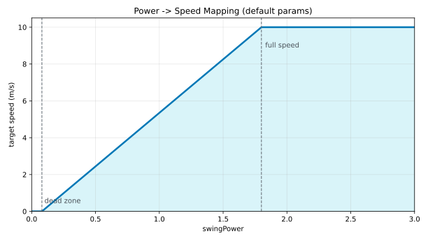

When trigger is released or arm swing stops, `DecayGait()` applies a quick decay (`tau = 0.3s`). In testing, this window avoids both hard-stop stiffness and excessive glide.

---

## 7. Direction and Rigidbody Velocity Write-back

Direction uses HMD horizontal forward:

```csharp
Vector3 forwardWorld = (hmd != null) ? hmd.transform.forward : transform.forward;
forwardWorld.y = 0f;
forwardWorld = (forwardWorld.sqrMagnitude > 1e-6f) ? forwardWorld.normalized : Vector3.forward;
```

The target horizontal velocity is stored in `desiredHorizontalVel`, then actually written in `FixedUpdate()` to stay aligned with physics stepping:

```csharp
Vector3 v = GetRBVelocity(rb);
Vector3 horiz = desiredHorizontalVel;

if (horiz.magnitude > fixedStepClampMps)
    horiz = horiz.normalized * fixedStepClampMps;

v.x = horiz.x;
v.z = horiz.z;
SetRBVelocity(rb, v);
```

Separating input/state update (`Update`) from physics write (`FixedUpdate`) avoids unstable speed behavior under frame-time variation.

---

## 8. Jump, Respawn, and Trigger Events

### 8.1 Button Jump

`A` triggers a jump by setting `v.y = jumpSpeedMps`, with cooldown protection.

- `jumpSpeedMps = 2.2`
- `jumpCooldown = 0.25`

```csharp
if (enableButtonJump && vrJumpPressed && (now - lastJumpTime >= jumpCooldown))
{
    DoJump();
    lastJumpTime = now;
}
```

| 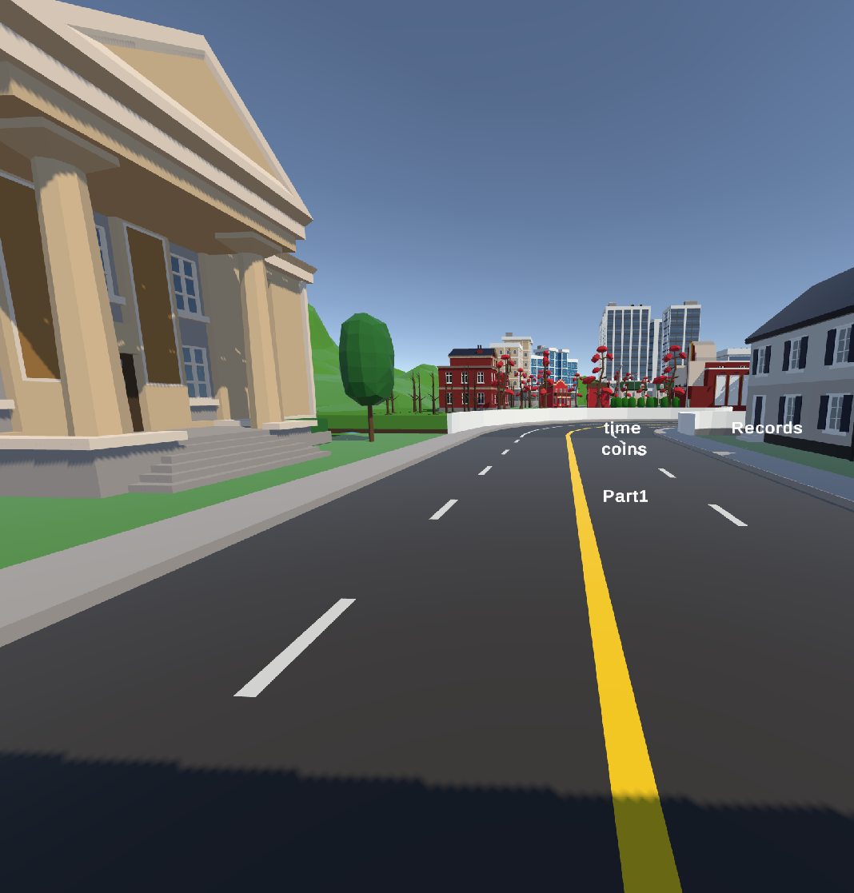 | 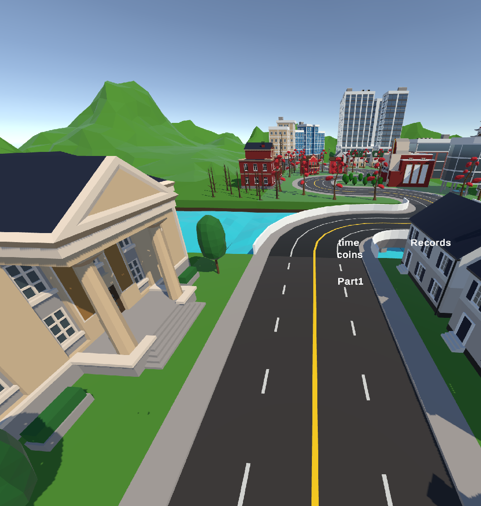 |
| --- | --- |

### 8.2 Respawn

`B` / `Y` resets the player to `parkourCounter.currentRespawnPos` (only after the run has started) and clears velocity.

```csharp
bool vrRespawnPressed = OVRInput.GetDown(OVRInput.Button.Two) || OVRInput.GetDown(OVRInput.Button.Four);
```

| 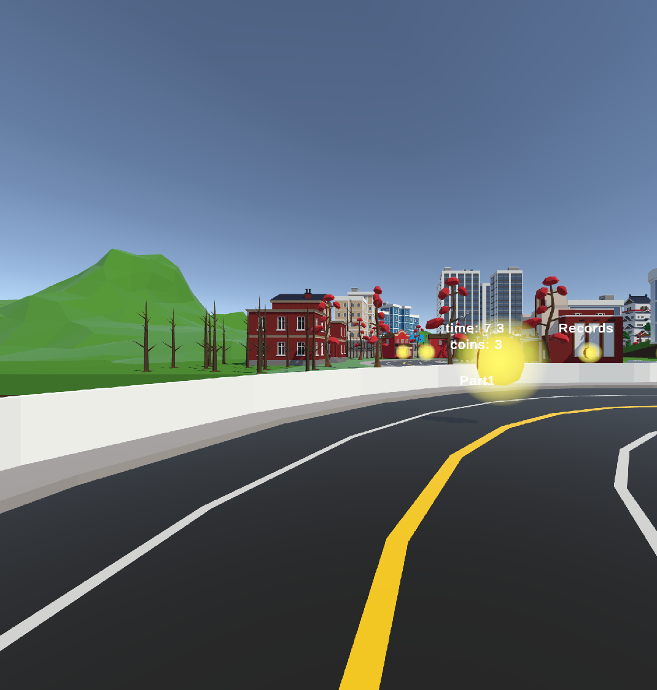 | 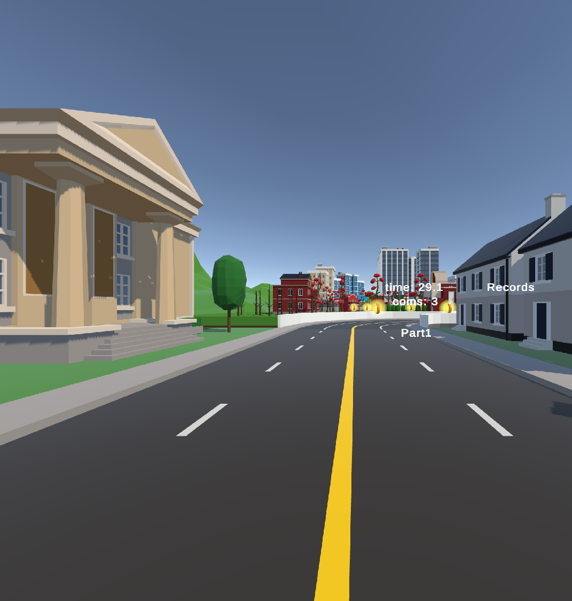 |
| --- | --- |

### 8.3 Trigger Event Handling

`OnTriggerEnter` in the same script handles:

- `banner`: stage transition hook for parkour flow
- `objectInteractionTask`: task UI and metrics initialization
- `coin`: increment coin count, play audio, disable collected coin object

---

## 9. Parameter Tuning Record

These are the parameter values used in the current parkour setup:

| Parameter | Value | Purpose |
| :--- | :---: | :--- |
| `triggerHoldThreshold` | 0.95 | Reduce accidental activation |
| `baselineTau` | 1.6 | Stabilize baseline in idle states |
| `baselineFreezeAbsSignal` | 0.08 | Freeze baseline under real swing amplitude |
| `powerTau` | 0.18 | Smooth power jitter |
| `powerDead` | 0.08 | Remove idle noise movement |
| `powerAtRun` | 1.8 | Set swing level needed for max-speed mapping |
| `maxSpeedMps` | 10.0 | Sprint speed cap |
| `accelMps2` | 14 | Start-up responsiveness |
| `decelMps2` | 20 | Braking responsiveness |
| `jumpSpeedMps` | 15 | Reach floating coins in final segment |

---

## 10. Test Workflow

To avoid a "looks okay" result and verify actual runtime behavior, I validated step-by-step:

1. Hold still for 3s and confirm no drift
2. Use low-amplitude swings and confirm movement starts only after `powerDead`
3. Sprint then release trigger and confirm quick speed decay (around 0.3s)
4. Run three curve-section trials and observe control quality
5. Collect floating coins using jump near the final segment
6. Trigger respawn at arbitrary points and verify position + velocity reset

| 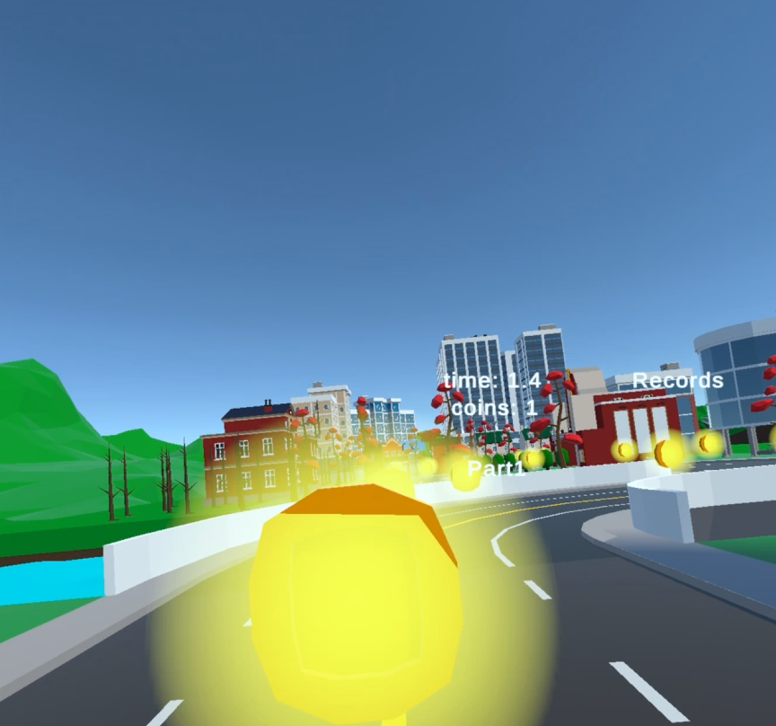 | 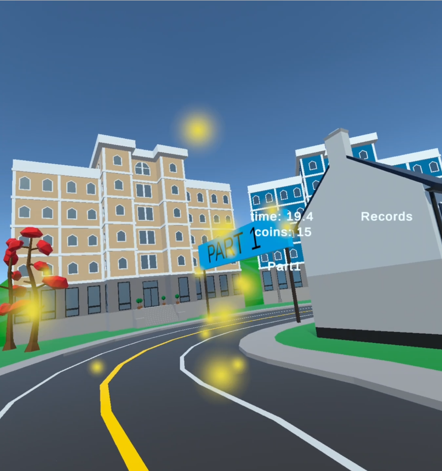 | 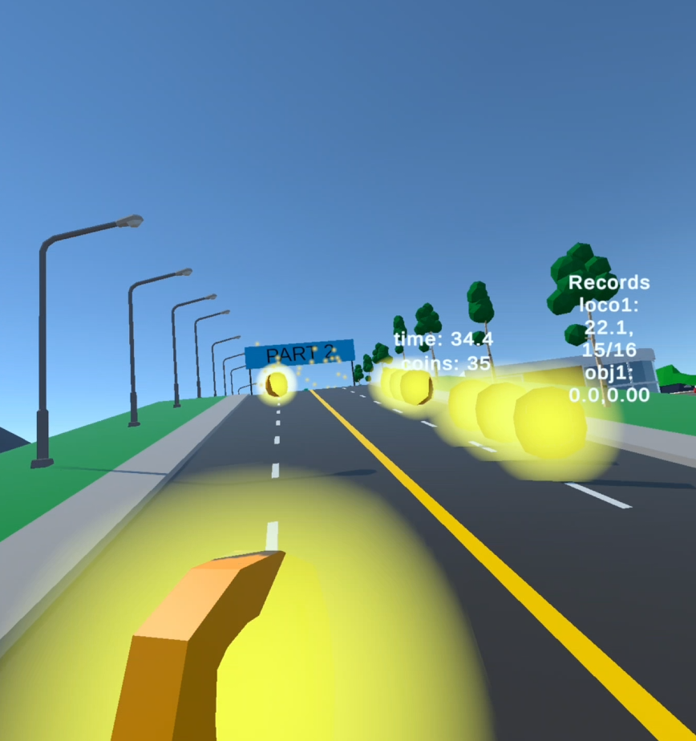 |
| --- | --- | --- |
| 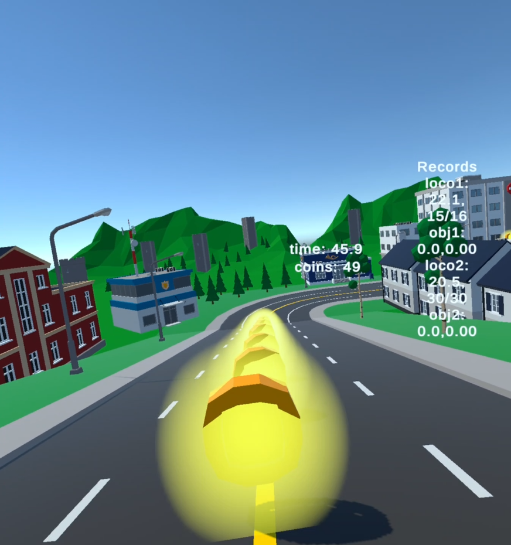 | 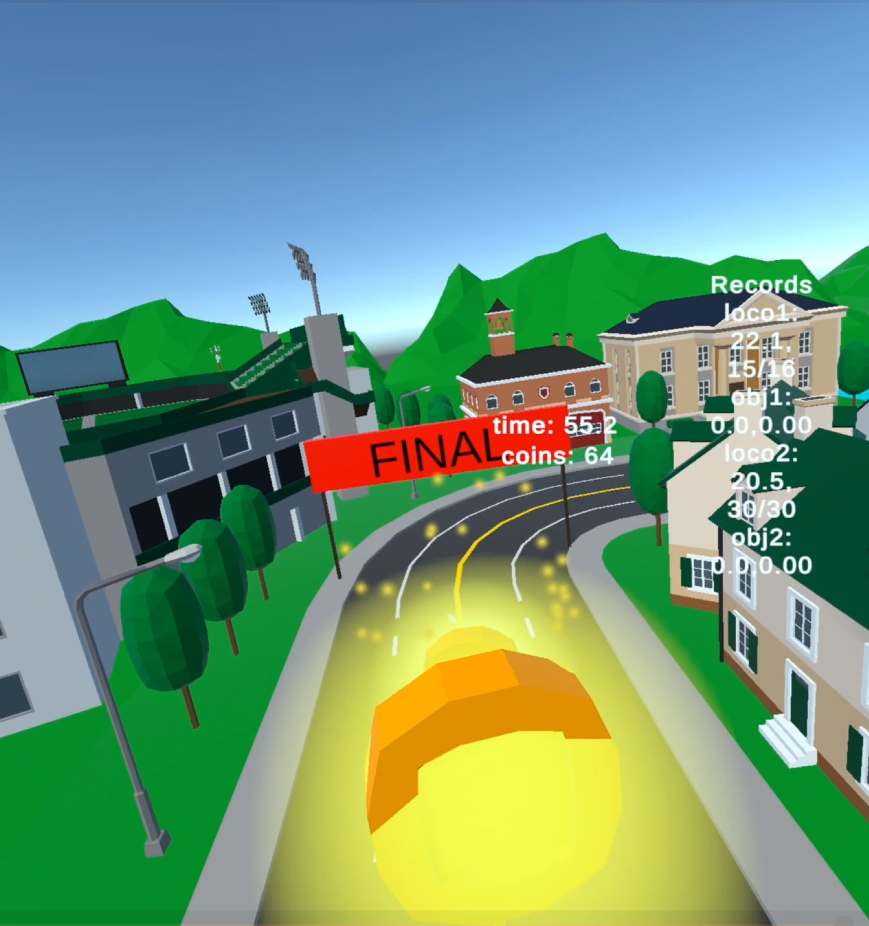 | 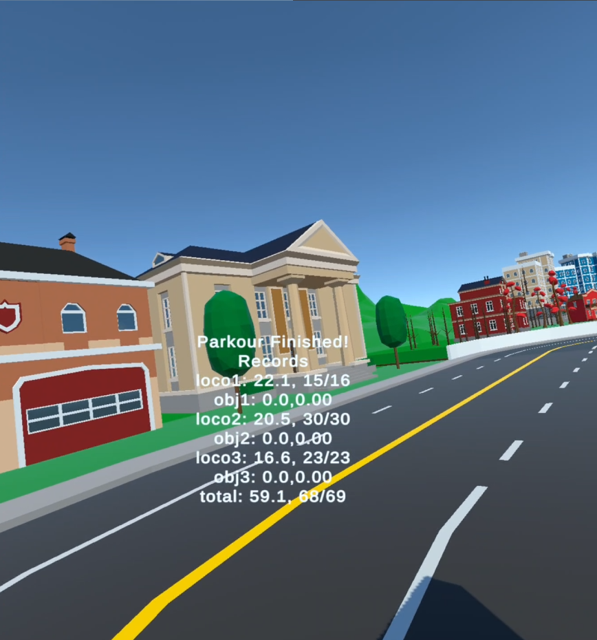 |

---

## 11. Repository and Demo Video

### 11.1 Code Repository

- GitHub: https://github.com/xyn-1127/Parkour

### 11.2 Demo Video

- Video: https://drive.google.com/file/d/1TcRcY6BeV1PBgIJC_9VAtvQiqFyYXvIN/preview


<iframe
  src="https://drive.google.com/file/d/1TcRcY6BeV1PBgIJC_9VAtvQiqFyYXvIN/preview"
  width="100%"
  style="aspect-ratio: 16 / 9; border: 0;"
  allow="autoplay"
  allowfullscreen>
</iframe>


---

## 12. Takeaways from This Implementation

At a structural level, this implementation is organized as:

- Outer gate for explicit movement intent
- Middle signal-processing layer that converts arm swing to stable power
- Lower physics layer for continuous movement output

For future iteration, I would prioritize two improvements:

- Adaptive speed limiting around dense curves (to reduce novice overshoot)
- Real-time speed feedback UI (to improve swing-to-speed understanding)

Both can be added as overlays on top of the existing pipeline without replacing the current architecture.

## 13. Full Source Code

`LocomotionTechnique.cs:`

```C#
using UnityEngine;

public class LocomotionTechnique : MonoBehaviour
{
    [Header("Respawn")]
    public OVRCameraRig ovrRig;
    public Transform trackingSpace;
    public Transform centerEyeAnchor;
    public float respawnFreezeSeconds = 0.15f;
    private bool _respawning;

    [Header("OVR / Rig References")]
    public OVRInput.Controller leftController;
    public OVRInput.Controller rightController;
    public GameObject hmd;

    [Header("Global Gain")]
    [Range(0, 10)] public float translationGain = 1.0f;

    [SerializeField] private float leftTriggerValue;
    [SerializeField] private float rightTriggerValue;
    [SerializeField] private bool isIndexTriggerDown;

    [Header("Physics Movement")]
    public bool useRigidbodyMovement = true;
    public bool autoConfigureRigidbody = true;
    public bool enableGravity = true;
    public float maxSpeedMps = 10.0f;
    public float walkSpeedMps = 2.0f;
    public float accelMps2 = 14f;
    public float decelMps2 = 20f;
    public float fixedStepClampMps = 10.0f;

    [Header("Grounding / Collision Check")]
    public LayerMask groundMask = ~0;
    public float groundCheckDistance = 0.15f;
    public float groundCheckStartOffset = 0.05f;
    [Range(0.5f, 0.99f)] public float groundProbeRadiusScale = 0.9f;

    [Header("Hold-to-Engage Gate")]
    [Range(0f, 1f)] public float triggerHoldThreshold = 0.95f;

    [Header("Arm-Swing Locomotion")]
    public bool enableArmSwing = true;
    public float abdomenOffsetMeters = 0.50f;

    [Header("Baseline (EMA)")]
    [Range(0.2f, 5f)] public float baselineTau = 1.6f;
    [Range(0.01f, 0.30f)] public float baselineFreezeAbsSignal = 0.08f;

    [Header("Swing Power -> Speed")]
    [Range(0.05f, 0.6f)] public float powerTau = 0.18f;
    [Range(0.1f, 6f)] public float powerAtWalk = 0.3f;
    [Range(0.2f, 12f)] public float powerAtRun = 1.8f;
    [Range(0f, 0.5f)] public float powerDead = 0.08f;
    [Range(0.1f, 5f)] public float gaitDecayTau = 1.8f;

    [SerializeField] private float leftSignalMeters;
    [SerializeField] private float rightSignalMeters;
    [SerializeField] private float swingPower;
    [SerializeField] private float gaitAxis01;

    private float _baseL, _baseR;
    private float _prevSigL, _prevSigR;
    private float _powerLP;

    [Header("Jump (Button)")]
    public bool enableButtonJump = true;
    public float jumpSpeedMps = 2.2f;
    public float jumpCooldown = 0.25f;
    private float lastJumpTime = -999f;
    public bool vrJumpUseButtonOne = true;

    private Rigidbody rb;
    private CapsuleCollider capsule;
    private bool leftTriggerHeld;
    private bool rightTriggerHeld;
    private Vector3 desiredHorizontalVel;
    private float prevUpdateTime;

    public ParkourCounter parkourCounter;
    public string stage;
    public SelectionTaskMeasure selectionTaskMeasure;

    void Awake()
    {
        rb = GetComponent<Rigidbody>();
        capsule = GetComponent<CapsuleCollider>();
    }

    void Start()
    {
        prevUpdateTime = Time.time;

        if (autoConfigureRigidbody && rb != null)
        {
            rb.isKinematic = false;
            rb.useGravity = enableGravity;
            rb.interpolation = RigidbodyInterpolation.Interpolate;
            rb.collisionDetectionMode = CollisionDetectionMode.ContinuousDynamic;
            rb.constraints = RigidbodyConstraints.FreezeRotation;
        }

        ResetPowerState(true);
    }

    void Update()
    {
        float now = Time.time;
        float dt = Mathf.Max(1e-4f, now - prevUpdateTime);

        leftTriggerValue = OVRInput.Get(OVRInput.Axis1D.PrimaryIndexTrigger, leftController);
        rightTriggerValue = OVRInput.Get(OVRInput.Axis1D.PrimaryIndexTrigger, rightController);
        leftTriggerHeld = leftTriggerValue > triggerHoldThreshold;
        rightTriggerHeld = rightTriggerValue > triggerHoldThreshold;

        bool vrEngaged = leftTriggerHeld || rightTriggerHeld;
        isIndexTriggerDown = vrEngaged;

        Vector3 forwardWorld = (hmd != null) ? hmd.transform.forward : transform.forward;
        forwardWorld.y = 0f;
        forwardWorld = (forwardWorld.sqrMagnitude > 1e-6f) ? forwardWorld.normalized : Vector3.forward;

        if (enableArmSwing && vrEngaged)
        {
            UpdatePowerFromVrHands(dt);
        }
        else
        {
            DecayGait(dt);
            leftSignalMeters = 0f;
            rightSignalMeters = 0f;
            swingPower = 0f;
        }

        float forwardAxis = vrEngaged ? gaitAxis01 : 0f;

        bool vrJumpPressed = false;
        if (enableButtonJump && vrJumpUseButtonOne)
        {
            vrJumpPressed = OVRInput.GetDown(OVRInput.Button.One);
        }

        if (enableButtonJump && vrJumpPressed && (now - lastJumpTime >= jumpCooldown))
        {
            DoJump();
            lastJumpTime = now;
        }

        float targetSpeed;
        float clampedAxis = Mathf.Clamp(forwardAxis, -1f, 1f);
        float absAxis = Mathf.Abs(clampedAxis);
        targetSpeed = Mathf.Sign(clampedAxis) * absAxis * maxSpeedMps * translationGain;

        Vector3 currentHoriz = Vector3.zero;
        if (rb != null)
        {
            Vector3 v = GetRBVelocity(rb);
            currentHoriz = new Vector3(v.x, 0f, v.z);
        }

        Vector3 targetHoriz = forwardWorld * targetSpeed;
        float accel = (Mathf.Abs(targetSpeed) > 0.01f) ? accelMps2 : decelMps2;
        desiredHorizontalVel = Vector3.MoveTowards(currentHoriz, targetHoriz, accel * dt);

        bool vrRespawnPressed = OVRInput.GetDown(OVRInput.Button.Two) || OVRInput.GetDown(OVRInput.Button.Four);

        if (vrRespawnPressed)
        {
            if (parkourCounter != null && parkourCounter.parkourStart)
            {
                Vector3 respawnPos = parkourCounter.currentRespawnPos;

                if (rb != null)
                {
                    SetRBVelocity(rb, Vector3.zero);
                    rb.angularVelocity = Vector3.zero;
                    rb.position = respawnPos;
                }
                else
                {
                    transform.position = respawnPos;
                }
            }
        }

        prevUpdateTime = now;
    }

    void FixedUpdate()
    {
        if (!useRigidbodyMovement || rb == null) return;

        Vector3 v = GetRBVelocity(rb);
        Vector3 horiz = desiredHorizontalVel;

        if (horiz.magnitude > fixedStepClampMps)
            horiz = horiz.normalized * fixedStepClampMps;

        v.x = horiz.x;
        v.z = horiz.z;
        SetRBVelocity(rb, v);
    }

    private void ResetPowerState(bool hard)
    {
        if (hard)
        {
            _baseL = 0f;
            _baseR = 0f;
            _prevSigL = 0f;
            _prevSigR = 0f;
            _powerLP = 0f;
            gaitAxis01 = 0f;
        }
    }

    private void UpdatePowerFromVrHands(float dt)
    {
        if (hmd == null) { DecayGait(dt); return; }

        Vector3 hmdLocal = hmd.transform.localPosition;
        Vector3 abdomen = hmdLocal + Vector3.down * abdomenOffsetMeters;

        Vector3 localForward = GetLocalForwardOnPlane();
        if (localForward.sqrMagnitude < 1e-6f) localForward = Vector3.forward;

        Vector3 leftLocal = OVRInput.GetLocalControllerPosition(leftController);
        Vector3 rightLocal = OVRInput.GetLocalControllerPosition(rightController);

        Vector3 leftRel = leftLocal - abdomen;
        Vector3 rightRel = rightLocal - abdomen;

        float leftRawF = Vector3.Dot(leftRel, localForward);
        float rightRawF = Vector3.Dot(rightRel, localForward);

        UpdatePowerFromRaw(dt, leftRawF, rightRawF);
    }

    private void UpdatePowerFromRaw(float dt, float leftRawF, float rightRawF)
    {
        float sigL0 = leftRawF - _baseL;
        float sigR0 = rightRawF - _baseR;

        bool freezeL = Mathf.Abs(sigL0) > baselineFreezeAbsSignal;
        bool freezeR = Mathf.Abs(sigR0) > baselineFreezeAbsSignal;

        float aBase = 1f - Mathf.Exp(-dt / Mathf.Max(1e-4f, baselineTau));
        if (!freezeL) _baseL = Mathf.Lerp(_baseL, leftRawF, aBase);
        if (!freezeR) _baseR = Mathf.Lerp(_baseR, rightRawF, aBase);

        float sigL = leftRawF - _baseL;
        float sigR = rightRawF - _baseR;

        leftSignalMeters = sigL;
        rightSignalMeters = sigR;

        float vL = (sigL - _prevSigL) / Mathf.Max(1e-4f, dt);
        float vR = (sigR - _prevSigR) / Mathf.Max(1e-4f, dt);
        _prevSigL = sigL;
        _prevSigR = sigR;

        float rawPower = Mathf.Abs(vL) + Mathf.Abs(vR);

        float aPow = 1f - Mathf.Exp(-dt / Mathf.Max(1e-4f, powerTau));
        _powerLP = Mathf.Lerp(_powerLP, rawPower, aPow);
        swingPower = _powerLP;

        float t = 0f;
        if (_powerLP <= powerDead)
        {
            DecayGait(dt);
            return;
        }
        else
        {
            float lo = Mathf.Max(1e-3f, powerDead);
            float hi = Mathf.Max(lo + 1e-3f, powerAtRun);
            t = Mathf.InverseLerp(lo, hi, _powerLP);
            t = Mathf.Clamp01(t);
        }

        float aG = 1f - Mathf.Exp(-dt / Mathf.Max(1e-4f, powerTau));
        gaitAxis01 = Mathf.Lerp(gaitAxis01, t, aG);
    }

    private void DecayGait(float dt)
    {
        float decayTau = 0.3f;
        float a = 1f - Mathf.Exp(-dt / Mathf.Max(1e-4f, decayTau));
        gaitAxis01 = Mathf.Lerp(gaitAxis01, 0f, a);
        _powerLP = Mathf.Lerp(_powerLP, 0f, a);
    }

    private void DoJump()
    {
        if (rb == null) return;
        Vector3 v = GetRBVelocity(rb);
        v.y = jumpSpeedMps;
        SetRBVelocity(rb, v);
    }

    private Vector3 GetLocalForwardOnPlane()
    {
        if (hmd != null)
        {
            Vector3 f = hmd.transform.localRotation * Vector3.forward;
            f.y = 0f;
            if (f.sqrMagnitude > 1e-6f) return f.normalized;
        }
        return Vector3.forward;
    }

    private static Vector3 GetRBVelocity(Rigidbody r)
    {
#if UNITY_6000_0_OR_NEWER
        return r.linearVelocity;
#else
        return r.velocity;
#endif
    }

    private static void SetRBVelocity(Rigidbody r, Vector3 v)
    {
#if UNITY_6000_0_OR_NEWER
        r.linearVelocity = v;
#else
        r.velocity = v;
#endif
    }

    void OnTriggerEnter(Collider other)
    {
        if (other.CompareTag("banner"))
        {
            stage = other.gameObject.name;
            if (parkourCounter != null) parkourCounter.isStageChange = true;
        }
        else if (other.CompareTag("objectInteractionTask"))
        {
            if (selectionTaskMeasure != null)
            {
                selectionTaskMeasure.isTaskStart = true;
                selectionTaskMeasure.scoreText.text = "";
                selectionTaskMeasure.partSumErr = 0f;
                selectionTaskMeasure.partSumTime = 0f;

                float tempValueY = other.transform.position.y > 0 ? 12 : 0;
                Vector3 tmpTarget = new Vector3(hmd.transform.position.x, tempValueY, hmd.transform.position.z);
                selectionTaskMeasure.taskUI.transform.LookAt(tmpTarget);
                selectionTaskMeasure.taskUI.transform.Rotate(new Vector3(0, 180f, 0));
                selectionTaskMeasure.taskStartPanel.SetActive(true);
            }
        }
        else if (other.CompareTag("coin"))
        {
            if (parkourCounter != null) parkourCounter.coinCount += 1;

            var audio = GetComponent<AudioSource>();
            if (audio != null) audio.Play();

            other.gameObject.SetActive(false);
        }
    }
}
```
