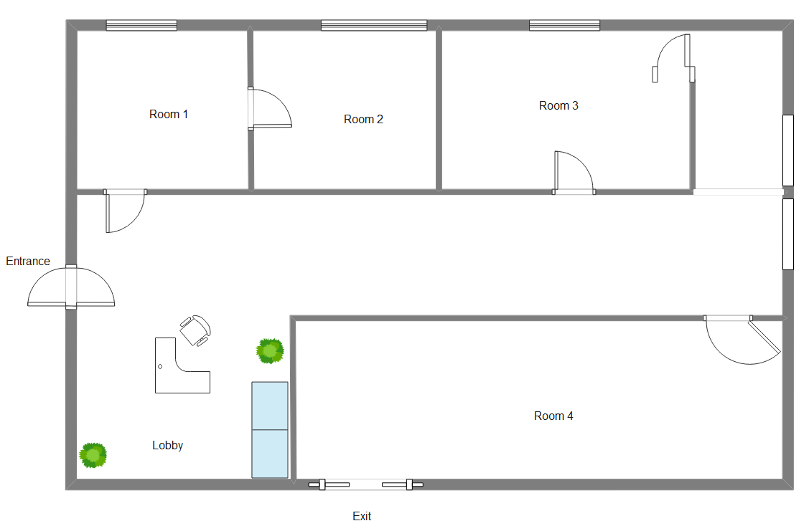
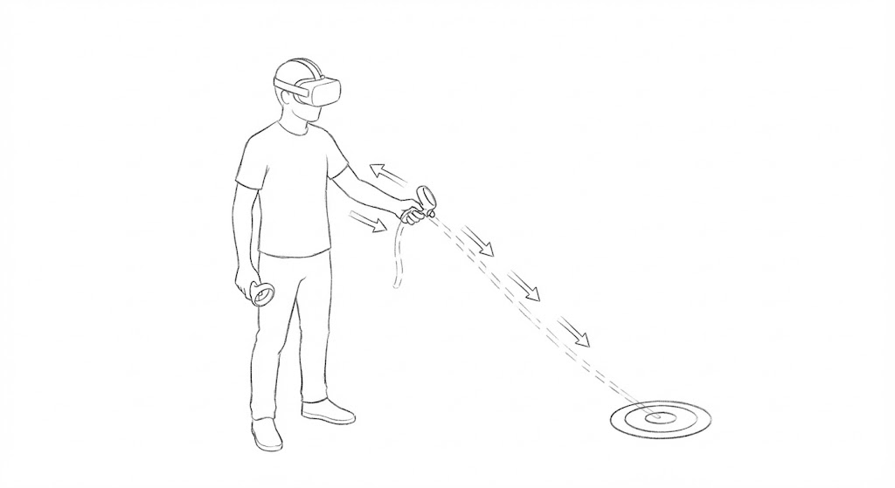
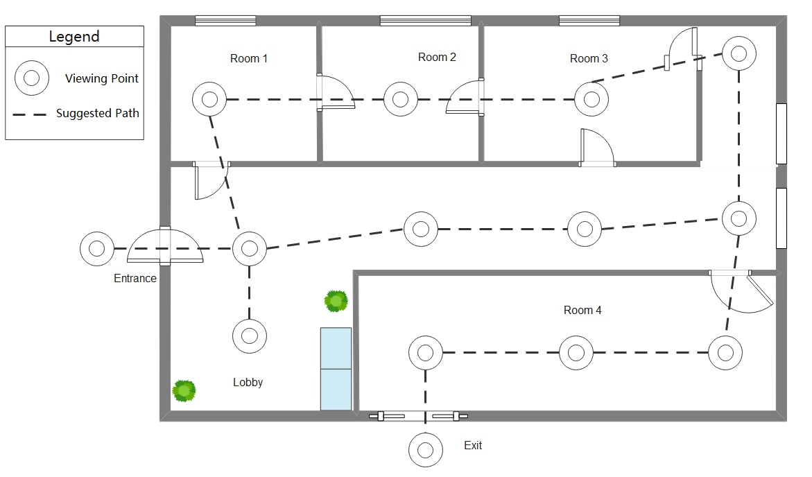
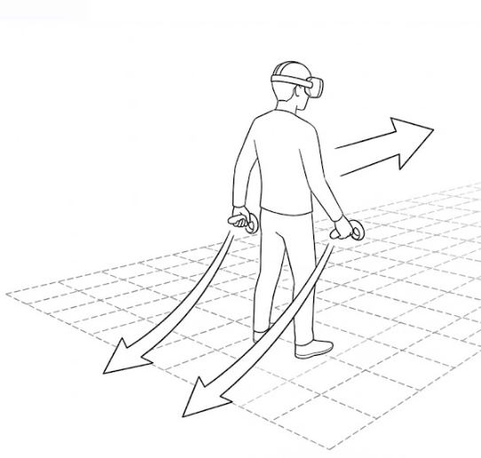
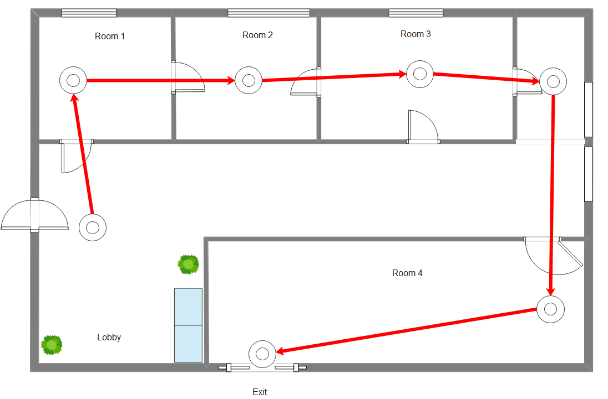

## Lecture Homework 1: Three VR Locomotion Designs 

### Scenario: A Modern Art Museum Tour

Imagine visiting a VR recreation of a modern art museum. The exhibition space does not need to be large, but it should create a clear motivation to move around. The task is straightforward: you will visit many exhibits in sequence. In front of each exhibit there is an “optimal viewing spot”, indicated by a subtle circular marker on the floor. Once you step into the marker and stand still, you read or listen to an explanation of about 15 seconds, then move on to the next exhibit, and finally reach the exit to complete the tour.

This scenario involves short-distance movement with frequent stop-and-go actions, and each stop requires relatively precise positioning. The experience is designed for standing users in a limited physical area, so comfort is a priority. Sudden acceleration, abrupt stops, or intense visual motion should be avoided.

---

### Design 1: Guide Rope Pull

This design targets a specific issue: in a stop-and-go task with short distances, movement should feel stable and allow precise stopping, while reducing discomfort that often comes with continuous joystick-based locomotion. The idea is to turn “moving” into a more controllable action: pulling yourself toward the next target.

The system provides a semi-transparent guide rope. One end is near the user’s hand, and the other end is attached to the next target point, i.e., the center of the viewing circle in front of an exhibit. The user grabs and pulls the rope backward; the avatar moves smoothly forward along the rope direction. A stronger pull produces a higher speed, but the maximum speed is kept conservative to prevent sudden bursts. To make it feel closer to real pulling, movement includes light damping: it accelerates smoothly at the start and decelerates smoothly when the user releases, rather than stopping instantly.

When the user reaches the target area, the system provides a clear but unobtrusive cue, such as slightly increasing the brightness of the floor circle or adding a soft pulse. This matters in a museum tour because users repeatedly switch between walking and reading; the confirmation should be quick and easy to interpret.

The strength of this method is stability and predictability, which makes it suitable for first-time VR users or tour modes where comfort is the top priority. The trade-off is reduced freedom: the target “pulls” your motion direction, so it feels more like guided touring than free exploration. In evaluation, I would therefore focus on whether stopping accuracy improves and whether users report better control and lower discomfort.

---

### Design 2: World-in-Hand Drag

The second design takes the opposite approach: instead of moving the user through the world, it moves the world around the user. It may look unusual, but it fits a museum setting where precise micro-positioning is often required.

The metaphor is similar to sliding a large map on a desk. The user “grabs” the floor or a semi-transparent grid plane with both hands and drags it backward. The drag direction is opposite to the resulting movement: dragging the world backward moves the user forward; dragging left moves the user right. To support fine adjustments, the user can also apply a slight twisting motion with both hands to make a small change in orientation, effectively rotating the scene around the user. Throughout the interaction, the user’s body remains standing in place; the motion comes from manipulating the space itself.

The goal is to return control to the user and make them feel they are actively controlling the space rather than being pushed through it. For a museum tour, this is especially useful for the last step of “getting inside the viewing circle”: moving forward 30 cm or shifting right 20 cm becomes as simple as nudging the world.

To keep it comfortable, strict limits and smoothing are necessary. Both translation speed and angular speed should stay in a comfort range, with smooth ramp-in and ramp-out to avoid sudden visual acceleration. The “grabbing” state must also be clearly visible, for example by slightly highlighting the grid when it is held, so users know they are intentionally moving the world rather than triggering motion by accident.

The risks are also clear: if translation or rotation becomes too fast, visual motion can become intense and cause discomfort. Another risk is unintended drift—when users only want to turn their head to look at a painting, the interaction should not accidentally move them. In evaluation, I would focus on how efficiently and accurately users can fine-tune their position, while confirming that comfort remains acceptable.

---

### Design 3: Arm-Swing Locomotion

The third design follows a walking-like intuition: the user stands in place and swings both arms forward and backward as in normal walking, and the system moves the avatar forward. Turning does not rely on an extra steering mechanism. Instead, it is done naturally by rotating the body: if you turn in the real room, your forward direction in VR follows your body and head orientation.

The goal is not extreme precision. Instead, it aims to make locomotion feel more like “I am walking”, improving bodily engagement and presence, while keeping discomfort at an acceptable level without relying on continuous joystick pushing.

Mechanically, this can be described as a clear mapping from arm motion to speed. The system tracks controller movement, extracts the intensity of forward–back swinging, and converts it smoothly into forward velocity. Stronger swings produce higher speed; when swinging stops, speed decays quickly to zero. To prevent cheating (e.g., shaking the controller in place), the detection should match real walking rhythm more closely: the arms should show alternating swings, or at least a stable, continuous forward–back pattern, with the main motion aligned with the intended forward direction. This makes the motion closer to an upper-body walking rhythm and helps explain why it produces a walking sensation.

Direction control remains simple: forward motion follows the horizontal orientation (yaw) of the head. To avoid small unintended drift when users stop and look around, a stabilizing rule can be added: direction is updated only while the system detects active walking swings above a threshold. When users stop to read or observe, turning the head will not affect position, preventing the uncomfortable feeling of slowly sliding away while looking at an exhibit.

The main costs of arm-swing locomotion are physical effort and fine positioning. It depends more on body rhythm, so long sessions may feel tiring. When highly precise stopping is required, it may be less stable than the rope method and less effective for millimeter-level adjustments than world dragging. In evaluation, I would focus on whether it feels more natural and engaging, how efficient it is in the same route task, and whether its stopping accuracy remains sufficient for a museum tour.

---

## Unified Evaluation Method: How to Compare the Three Designs Fairly

To make the comparison fair, all three locomotion techniques should be tested under the same task and environment, changing only the locomotion method itself. The evaluation does not need complex equipment or a large-scale study, but it should answer one concrete question: did each design achieve its stated goal?

The study is designed for standing use. Participants enter the same virtual museum and complete the same route: starting from the entrance, visiting 6 exhibit viewing spots in sequence, and remaining inside each viewing circle for 2 seconds to count as “arrived”, then moving to the next exhibit and finally reaching the exit. Before each locomotion condition, participants get a short practice period to learn the interaction. The order of the three conditions is counterbalanced to reduce learning effects.

Data collection includes both objective and subjective measures.

Objective measures focus on efficiency and precision. Efficiency is measured by total completion time, and also by segment times between exhibits to detect frequent pauses or hesitation. Precision is measured by stopping error: the distance between the participant’s position and the center of the viewing circle at arrival, as well as the number of fine-adjustment actions and the time spent on those adjustments. For the world-in-hand method, adjustment counts are especially informative; for the rope method, overshoot and pull-back events reflect controllability. To capture path quality, route deviations can also be counted, such as repeatedly drifting close to walls or visibly zig-zagging in corridors.

Subjective measures capture comfort and experience goals. After each locomotion condition, participants provide short ratings on a 7-point scale with direct questions: nausea/dizziness, ease of control, sense of being in control of motion, naturalness, fatigue, and whether they would choose this method in a real museum tour. A brief final interview can ask participants to describe the most comfortable and least comfortable moments in each condition, and which method they would prefer overall for museum visiting.

In analysis, I would not rely on total time alone. The results should be interpreted in relation to the task. The rope method is expected to reduce stopping error and improve stability and comfort. World-in-hand drag is expected to speed up fine positioning and feel like precise spatial control. Arm-swing locomotion is expected to provide stronger engagement and naturalness, but potentially at the cost of fatigue and fine stopping performance. If each method performs well on the measures aligned with its goal and does not cause unacceptable discomfort, it can be considered to have achieved its design objective.