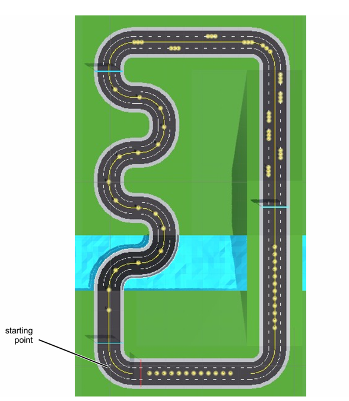
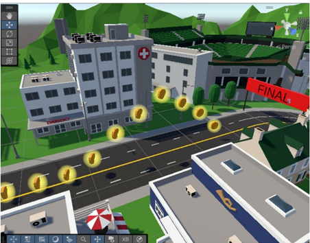

The goal of this homework is straightforward: design a locomotion technique that fits the provided VR parkour scene better than the default. The level is a fixed route with banner timing checkpoints and lots of collectible coins. The key twist is that not all coins are on the ground—some are floating slightly above it. So it’s not just about moving fast. You also need to stop on demand, make small position corrections, and occasionally perform a small vertical action to reach elevated coins.

## Scene Breakdown

If you zoom in on what “parkour” demands, it’s much stricter than simply “walk from A to B in an open space.” For this route, I see three constraints stacked together:

1. **Continuous turns**: you keep steering. At higher speed, any small control error gets amplified and pushes you off the intended line.  
2. **Short sprint–brake cycles**: to collect coins efficiently, you accelerate, decelerate, and re-accelerate within very short distances, often with small heading corrections.  
3. **Occasional vertical reach**: some coins sit above the floor. Pure horizontal motion becomes awkward—you either miss them or you have to compensate with unnatural movement.  

The top-down map makes the structure obvious: curved segments, long straights, and multiple banner checkpoints. In practice, this means you repeatedly sprint, brake, re-center, and sprint again rather than moving at a steady cruising speed.

The height difference of coins is a hard constraint. It’s not decorative—it forces the locomotion design to answer a concrete question: how do you handle a small vertical action in a clean, comfortable way? That is exactly why I introduced the pump jump later.

## Design Goals

I’m not trying to build the most realistic walking simulator here. In a parkour route, controllability and efficiency come first: you should be able to move fast, but also stop instantly, steer reliably, and fine-tune your position—without that frustrating feeling of “I wanted to stop, but I’m still sliding.”

My goals can be summarized in four lines: fast but controlled; more embodied (closer to a running metaphor); comfort-first with predictable speed changes; and usable in a small physical space without real room-scale running.

## Baseline: Why Pose-Based Arm-Swing Feels Wrong for Parkour

The starter project already includes an arm-swing style locomotion, which I use as the baseline. Its trigger logic is intentionally simple: while holding an enable button, you keep one hand forward and the other backward, and you keep moving forward. You don’t need a real swing cycle or a stable rhythm—maintaining a similar pose can already produce continuous motion.

In a casual exploration scene, this can be easy to learn and easy to implement. But in parkour, the weaknesses become obvious. There is no clear “step boundary,” so continuous drift is common; stopping intent is ambiguous (you think you stopped, but the relative hand pose still drives motion); and overall it feels like holding a pose rather than walking or running, which clashes with the action-heavy nature of a parkour route.

So my direction is simple: switch from pose-holding to rhythm-triggered motion.

## My Proposal: Gait-Based Arm-Swing Locomotion

My version is gait-based. The core rule is intentionally strict:

**Motion happens only when the arms truly alternate and swap their front/back positions.**

I like this rule because it makes intent explicit. Walking is not “one arm forward forever”—it is alternation. When the rhythm stops, you should stop. When the rhythm speeds up, you should speed up. Compared to a pose-based trigger, this matches what people naturally do in a parkour sprint and makes it easier to build reliable control.

## Core Interaction Design

I structure the interaction into three parts: a hold-to-engage gate, step detection from alternation, and a small vertical assist for elevated coins.

### 1) Hold to Engage

The first layer is a strict safety gate: you only move while holding the enable button, and you stop immediately when releasing it. In parkour you constantly move your hands for aiming, grabbing, and looking around. If locomotion is too easy to trigger by accident, the experience becomes messy very quickly. Hold-to-engage tells the system “I am intentionally moving right now,” reducing unwanted motion.

### 2) Alternation = Steps

The second layer is step detection. My intuitive criterion is: left and right arms should be in **anti-phase** and actually **swap**. In other words, if the left is in front and the right is behind, and then the right becomes front while the left becomes back, that counts as one valid gait event.

This immediately fixes two annoying issues in parkour. First, a static pose produces no motion, so drift is greatly reduced. Second, stopping becomes unambiguous: when you stop the rhythm, your speed quickly falls back to zero—no guessing whether the system “agrees” that you stopped.

I keep speed mapping deliberately simple. The number of alternations per second is the cadence, and cadence maps to forward speed. For comfort and stability, I apply two constraints on top: smoothing (so small jitter doesn’t create sudden bursts) and a speed cap (so “maximum sprint” stays controllable and does not push users into discomfort).

### 3) Pump Jump: A Small Vertical Assist for Elevated Coins

Some coins sit above the floor. With purely horizontal motion, you often end up just a bit too low, or you need an awkward route angle to reach them. I add a small vertical assist: while maintaining alternation, the user performs a quick down-then-up “pump.” If the avatar is grounded, it triggers a small hop to cover that small height gap.

This is intentionally a hop, not a big jump. In parkour you are mainly moving horizontally; a small hop is enough for slightly elevated coins. Larger vertical motion would introduce stronger up-down acceleration in the view, which is more likely to affect comfort. I also include a cooldown to prevent jump spamming and continuous camera bobbing.

## Interaction Details

With arm-swing locomotion, the real danger is not “too slow,” but “unstable.” So I add a few concrete constraints to make the system reliable in a high-tempo parkour route.

#### Stopping and Anti-Drift Rules

- **No alternation, fast decay to zero**: once the rhythm breaks, speed should drop quickly—no lingering glide.  
- **Deadzone**: tiny controller noise should not count as a step.  
- **Step timeout**: if no new alternation event arrives for a while, treat it as stopping and prevent slow drifting.  

#### Direction Control

I avoid extra steering gestures. In parkour you naturally turn your body to look ahead. So I use a head-forward rule: movement follows the yaw of where you face. When you turn, the direction turns with you—simple and intuitive.

#### Lightweight Feedback

A common issue is that users don’t know whether they are swinging “enough” to sustain speed, especially at the beginning. My preference is subtle feedback that doesn’t distract from the route: a light cadence tick, or a small speed bar showing the current cadence-to-speed result. The goal is not decoration—it’s to reduce uncertainty like “why did I suddenly slow down?” or “why did I suddenly surge?”

## Reflection and Next Steps

I think gait-based arm-swing fits parkour better than a pose-based trigger, but it is not perfect. I want to be explicit about trade-offs so the next iteration has a clear direction.

- **Strengths**: clear stopping intent, controllable speed, less drift, and a motion metaphor that feels closer to running—better aligned with parkour tempo.  
- **Cost**: more physical effort. After one full route, arms can get tired more quickly than with the pose-based baseline.  
- **Risk**: if the cadence-to-speed mapping is too sensitive (or smoothing is too weak), users may feel slight jitter, especially when their swing amplitude is inconsistent.  

If I iterate further, I would prioritize three improvements:

1. **Personal calibration**: people vary a lot in swing amplitude and rhythm. A short 20-second calibration before the route could make the mapping more consistent.  
2. **Low-speed precision mode**: at low speed, make micro-corrections more forgiving so collecting coins in tight spaces feels less “miss–overcorrect–miss again.”  
3. **Smarter pump-jump gating**: make the hop easier to trigger only where elevated coins actually require it, and more conservative elsewhere, so it behaves like a parkour tool rather than an always-on extra action.  