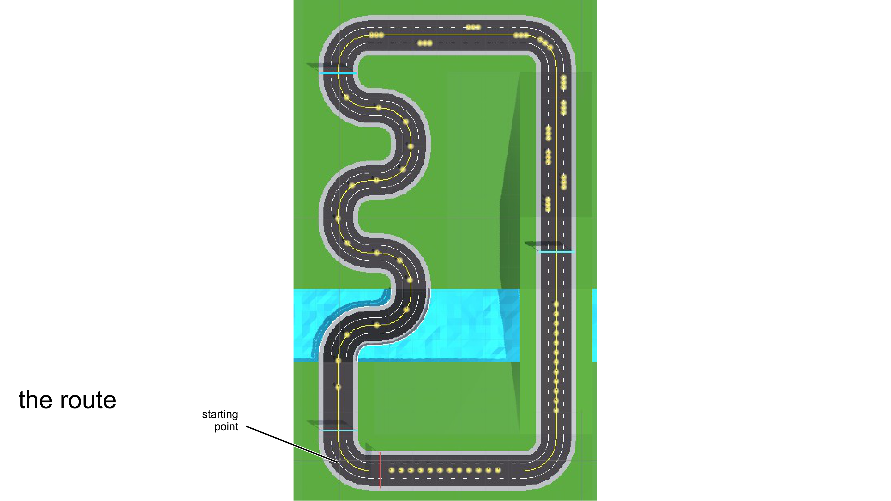
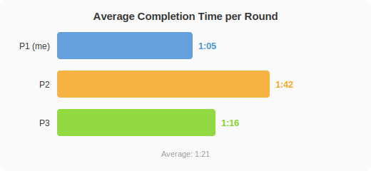
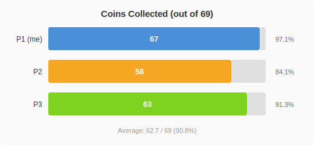

The goal of HW3 is to run a small-scale user evaluation of my locomotion technique. I recruited two participants and joined as the third myself. Each of us ran the parkour course for three full rounds, recording objective performance data and subjective ratings to see how the system holds up in real users' hands.

---

## Evaluation Design

### Why Evaluate at All

As the developer, I know the system too well. I know every parameter, the optimal entry angle for each curve, what swing cadence maps to what speed. But all of that was accumulated over dozens of iterative test sessions. A first-time user's experience could be entirely different.

This evaluation aims to answer three questions:

- Can someone with no development experience pick up the interaction quickly?
- How well does the technique perform in a parkour scenario that demands both speed and precision?
- Is the comfort level acceptable?

### Participants

| Participant | VR Experience |
| :---: | :---: |
| **P1 (me)** | Intermediate |
| **P2** | Novice (first time) |
| **P3** | Intermediate |

P2 had never used VR before, with zero prior experience in spatial perception or controller operation in virtual environments. P3 had some VR experience but had never tried arm-swing locomotion. Neither had seen the code or tried the system beforehand.

I gave roughly 30 seconds of verbal instruction: "Hold the index trigger to activate movement, swing your arms like running, faster swings mean faster movement, stop swinging to stop, press A to jump." Then 1 minute of free practice before starting the course. The instructions were kept deliberately minimal to test the technique under near-zero learning conditions. If users need a detailed tutorial to operate, the technique's intuitiveness itself is the problem.

### Course and Task

The course is a fixed VR parkour route with dense curves, straight sprints, and some floating coins. There are 69 coins in total along the course, with some suspended above ground level, requiring a jump to collect.

The course design puts the locomotion technique through a multi-dimensional test: continuous curves demand precise steering and speed management; the spatial distribution of coins requires fine positional adjustments while moving; floating coins add a vertical control requirement on top. This is not a simple "walk from A to B" test. It is a combined task of maintaining control precision under speed pressure.

Each participant completed 3 full rounds, collecting as many coins as possible while recording completion time per round. The three-round design was intended to observe learning effects: if participants improve in later rounds, the control logic is learnable.

### Dependent Variables

Following the assignment requirements, the following dependent variables were collected:

**Objective metrics:**

- Average completion time per round
- Number of coins collected
- Completion rate (whether all 3 rounds were finished)

**Subjective metrics (filled out after all 3 rounds, 1–10 scale):**

- **Motion Sickness**: *"How much motion sickness do you perceive right now?"* (1 = none, 10 = severe)
- **Ease of Use**: *"How easy was it to perform the task?"* (1 = very difficult, 10 = very easy)
- **Presence**: *"How present did you feel in the virtual world?"* (1 = not at all, 10 = fully immersed)
- **Enjoyment**: *"How much fun did you have?"* (1 = none, 10 = a lot)

---

## Objective Results

### Completion Time

| Participant | Avg. Time per Round |
| :---: | :---: |
| P1 (me) | 1:05 |
| P2 | 1:42 |
| P3 | 1:16 |
| **Average** | **1:21** |

P1 was fastest, which is expected given dozens of hours of development and testing that built deep familiarity with the course layout and system response. The more meaningful data comes from P2 and P3: P2, a complete VR novice (first time ever wearing a headset), was about 26 seconds slower than P3 but still completed all 3 rounds without getting stuck or being unable to operate the system.

All three participants achieved a 100% completion rate. This number alone says something: even a first-time VR user can finish the entire course after a minimal briefing. Basic usability is confirmed.

Looking at behavioral differences during the runs, the biggest divergence appeared in curve sections. P2 frequently fell into a typical loop at continuous turns: rush into the curve at high speed → realize the trajectory is off → hard brake → adjust heading → re-accelerate. Each cycle cost roughly 3–5 seconds, and it repeated multiple times in curve-dense segments. This was the primary factor behind the time gap. P3 occasionally overshot curves too, but recovered noticeably faster; the spatial awareness from prior VR experience was a clear advantage here. In contrast, straight sections showed much smaller performance gaps. The linear acceleration logic of arm-swing was intuitive enough for everyone.

### Coin Collection

| Participant | Collected (out of 69) | Rate |
| :---: | :---: | :---: |
| P1 (me) | 67 | 97.1% |
| P2 | 58 | 84.1% |
| P3 | 63 | 91.3% |
| **Average** | **62.7** | **90.8%** |

An average collection rate of 90.8% indicates that the arm-swing locomotion provides usable control precision. Users could not only move forward quickly but also make reasonably precise positional adjustments to hit coin colliders where needed.

P1 missed only 2 coins, both in tricky corner placements that were difficult by course design. P2 missed 11, with losses concentrated in two scenarios: unstable speed control at curves causing the trajectory to miss coin colliders, and mistimed jumps at floating coins. P3 missed 6, similar to P2 but at lower frequency.

All three patterns point to the same underlying issue: fine-grained control of speed and position requires practice. The basic operations of arm-swing (move forward, stop, turn) can be learned within a minute, but precisely controlling trajectory and braking points at high speed takes more muscle memory.

---

## Subjective Ratings

After completing the course, all three participants answered four subjective questions.

| Metric | Avg. Score |
| :---: | :---: |
| Motion Sickness (lower = better) | 2.7 |
| Ease of Use (higher = better) | 7.0 |
| Presence (higher = better) | 7.7 |
| Enjoyment (higher = better) | 8.0 |

### Motion Sickness: Acceptable Range

Average 2.7, with no reports of severe discomfort. Considering the course includes dense curves and frequent acceleration/deceleration, this is a solid result.

The arm-swing technique's movement direction follows head orientation, so when users turn their head toward a curve their body naturally rotates too. This maintains a degree of vestibular-visual consistency, which in theory produces less motion sickness than pure joystick turning (where the view rotates but the body does not). The Hold-to-Engage gate also gives users constant explicit control over movement: release the trigger and you stop, no uncontrolled passive displacement. Both factors contribute positively to comfort.

### Ease of Use: Manageable Learning Curve

Average 7.0. Given that P2 was a first-time VR user, this score suggests the operational logic of arm-swing is not inherently complex. Swinging your arms to run is a body metaphor everyone understands without learning abstract mapping rules.

That said, 7.0 is not exceptionally high either. Real-time speed feedback (such as a semi-transparent speed bar in the field of view) could make the current operating state clearer to users and potentially push this score higher.

### Presence: Consistently Positive

Average 7.7, the highest of the four metrics and also the one with the lowest variance. All three participants independently gave high immersion ratings. Physically swinging your arms to drive the avatar forward is evidently more effective at building a sense of presence than pushing a joystick. This aligns with existing findings in arm-swing locomotion research: the closer the body action matches real movement patterns, the stronger the user's immersion.

### Enjoyment: Highest Average Score

Average 8.0, the top score among the four subjective metrics. The interactivity of arm-swing is something joystick control simply cannot replicate. Using body movement to drive virtual locomotion is inherently game-like, especially in a parkour scenario that emphasizes speed and rhythm. The correspondence between swing cadence and movement speed makes the whole experience feel more like "running" than "operating."

---

## Discussion

### Positive Findings

1. **All participants completed all 3 rounds.** Including P2 who had never used VR before. The learning threshold is manageable: 30 seconds of verbal instruction plus 1 minute of practice was enough for basic proficiency, and no participant gave up due to inability to operate.

2. **90.8% average coin collection rate indicates usable control precision.** On a compound course with curves, straights, and floating coins, this number shows that arm-swing enables not just "reaching the destination" but also making reasonably precise positional adjustments. This is the key metric separating "functional" from "good" locomotion.

3. **Motion sickness stayed low.** An average of 2.7 on a high-speed, curve-heavy parkour course is a good result. Head-forward direction control and Hold-to-Engage gating show initial evidence of positive contributions to comfort.

4. **Immersion and enjoyment received consistent recognition.** Presence at 7.7 and Enjoyment at 8.0 confirm that the physical engagement of arm-swing adds real value at the user experience level.

### Areas for Improvement

1. **Curve control remains the primary pain point for novices.** P2's repeated "overshoot → brake → re-orient → re-accelerate" cycle at curves was the main factor behind the time gap. Possible improvements include: increased steering sensitivity at low speed, automatic speed cap reduction in curve zones, or turn-ahead warning cues.

2. **Jump timing for floating coins is not intuitive enough.** Some participants reported uncertainty about the best position and timing for jumps. A simple visual cue (such as highlighting when approaching a floating coin) could help, though this is more a course design improvement than a locomotion issue per se.

3. **Lack of real-time operational feedback.** Users were unsure whether their swing amplitude was sufficient or what speed level they were at. A simple speed indicator bar or rhythmic audio cue could reduce cognitive load for novices and make the operating state more transparent.

### Limitations

Three participants is too small a sample for statistical testing, and there was no control group (no comparison against other locomotion techniques). These results can only reflect the technique's absolute performance level, not its relative standing against alternatives. A more formal experiment would require a larger sample and a within-subjects comparison design.

Additionally, P1's data as the developer has limited reference value. The developer has full expectations of the system's acceleration and deceleration behavior, a naturally higher motion sickness threshold, and course familiarity that inflates both completion time and coin collection rate. Strictly speaking, P1's data is better treated as a theoretical ceiling rather than a representation of typical users.

---

## Summary

The core conclusion from this three-person evaluation: Power-Based Arm-Swing is a usable, comfortable, and immersive locomotion technique for VR parkour. A 100% completion rate confirms manageable onboarding, 90.8% coin collection confirms usable control precision, and an Enjoyment average of 8.0 confirms that physical engagement genuinely enhances user experience.

Curve control precision is the clearest area for improvement, particularly prominent with VR novices. If iteration continues, real-time speed feedback and adaptive steering sensitivity are the two highest-priority improvements.
