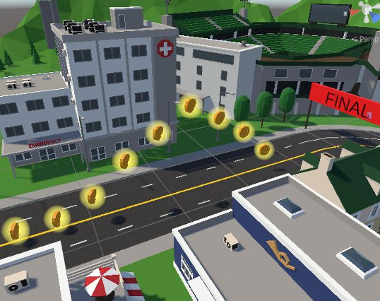

This post covers the full content of my final locomotion presentation, organized into three parts: scenario and design goals, system mechanisms, and user evaluation.

---

## Scenario & Challenges

The project scenario is a fixed VR parkour course: a timed race track where you collect coins along the way. The course has multiple checkpoints, continuous curves, and some coins floating above ground level.

The final section of the course is particularly important: several coins sit visibly above the ground, making pure horizontal locomotion insufficient. This constraint directly shaped the locomotion design, which must include some form of vertical movement.

The course stacks three requirements on top of each other:

- **Continuous Turns**: dense curves where any control error at speed gets amplified, demanding precise steering
- **Sprint-Brake Cycles**: to collect coins efficiently, users need frequent acceleration, deceleration, and re-acceleration, often with small heading corrections
- **Floating Coins**: horizontal-only locomotion falls short here; the technique must cover some vertical displacement

These three demands coexisting means a single movement logic can hardly satisfy all of them at once. That is why the final design uses a layered approach, with each layer addressing one specific problem.

---

## Design Goals

Given the parkour course constraints, I set four design goals for the locomotion technique:

- **Fast but Controllable**: able to sprint, but also make precise adjustments when needed. Parkour is not a stroll, but uncontrolled high speed is equally useless.
- **Clear Stopping Intent**: stop when you want to stop, with no residual drift. Decelerating before a curve, pausing next to a coin to fine-tune position: these actions rely on a clean stopping mechanism.
- **No Accidental Triggers**: prevent non-locomotion hand gestures from being misinterpreted as movement intent. Users frequently move their hands for other purposes in parkour (natural arm motion when reaching for coins, adjusting posture), and the system should not treat those as locomotion input.
- **Intuitive Direction**: look where you want to go. On a course that demands frequent turns, direction control must be intuitive enough to add zero cognitive overhead.

---

## System Overview: Three Core Mechanisms

The technique is built from three layered mechanisms, each targeting a specific problem:

1. **Hold-to-Engage**: a safety gate; hold the trigger to activate movement, preventing accidental triggers
2. **Power Detection**: the core engine; arm swing speed maps to movement speed
3. **Head-Forward**: direction control; head orientation determines movement direction

The three layers are independent but work together: Hold-to-Engage decides *whether* you move, Power Detection decides *how fast*, and Head-Forward decides *where*.

---

## Mechanism 1: Hold-to-Engage

This is a safety gate for movement. Press and hold the index trigger (threshold at 95%) to activate the locomotion system. Release the trigger and you decelerate to a full stop immediately. Either hand can activate it.

Why is this layer necessary? In parkour, your hands are constantly in motion: swinging, adjusting posture, reaching for objects. Without this gate, normal hand movement could be misread as locomotion intent, causing uncontrolled displacement. In an arm-swing technique specifically, hand motion *is* the speed source. Without a clear on/off switch, the system cannot distinguish between "I am intentionally moving" and "I am just naturally gesturing."

The 95% threshold is intentional. A light brush on the trigger will not activate movement; you have to deliberately grip to engage. This further reduces accidental activation. The trade-off is that it requires sustained grip force, which in a 3-4 minute course run is not a problem, but in longer experiences might call for an alternative (like a toggle mode).

---

## Mechanism 2: Power Detection

The core idea is to detect arm swing **speed**, not position. This is fundamentally different from traditional pose-based arm-swing, which detects a static hand arrangement (one forward, one back). Power Detection focuses on the rate of change of hand position over time.

The calculation pipeline has the following steps:

**Step 1: Abdomen reference point**

$$
P_{abdomen} = P_{HMD} - (0, 0.5, 0)
$$

The HMD position offset 0.5m downward serves as an abdomen reference. This reference point eliminates the effect of user height differences and posture variations. Regardless of how tall the user is or whether they lean slightly forward, hand motion is always computed relative to the abdomen.

**Step 2: Relative hand position**

$$
r_L = P_{left} - P_{abdomen}
$$

$$
r_R = P_{right} - P_{abdomen}
$$

**Step 3: Forward projection (Signal)**

$$
s_L = r_L \cdot f
$$

$$
s_R = r_R \cdot f
$$

Here $f$ is the HMD's horizontal forward direction. This step projects 3D hand movement onto the forward-backward axis, extracting only the component relevant to walking direction. Lateral arm movement is ignored, which matches the natural pattern of arms swinging along the body's front-back axis when running.

**Step 4: Signal velocity (time derivative)**

$$
v_L = (s_L(t) - s_L(t - \Delta t)) / \Delta t
$$

$$
v_R = (s_R(t) - s_R(t - \Delta t)) / \Delta t
$$

Taking the derivative of the signal yields velocity. The critical point here is that we measure velocity, not displacement. This means the arms must be actively moving to produce a valid signal. When hands are stationary, regardless of their position, velocity is zero. This is the core reason the technique can achieve a clear stopping intent.

**Step 5: Swing power**

$$
Power = |v_L| + |v_R|
$$

The sum of the absolute velocities of both hands is the raw power value. We take absolute values because whether the hand swings forward or backward, it should contribute positively to movement speed. Every half-cycle of a running swing does work.

---

## Power → Speed Mapping

| Parameter | Value |
| :---: | :---: |
| Dead Zone | 0.08 |
| Power at Run | 1.8 |
| Max Speed | 10 m/s |

The dead zone filters out hand tracking noise, preventing minor jitter from being interpreted as intentional swinging while stationary. The threshold of 0.08 was tuned through testing: too low causes slight drift at rest, too high makes the system feel unresponsive, requiring exaggerated swings to register.

Above the dead zone, power maps linearly to $[0, v_{max}]$. $Power = 1.8$ corresponds to full speed at 10 m/s, which requires a fairly vigorous swing cadence. Normal swinging typically produces power in the 0.3–0.8 range, mapping to 2–5 m/s of moderate speed. The mapping is deliberately kept linear with no curves or piecewise functions. Swing faster, run faster. Intuitive and predictable.

---

## Stopping & Jumping

**Quick Stop:**

Two trigger conditions: release the trigger, or stop swinging your arms. Either one results in a full stop within about 0.3 seconds. This 0.3-second deceleration window is a deliberate design choice. Snapping instantly to zero feels mechanical and jarring, but dragging it out too long makes users feel an uncontrolled "sliding" sensation. The 0.3s short decay felt natural in testing: fast enough to stop precisely at a target position, slow enough to avoid the discomfort of a hard stop.

**Button Jump:**

For collecting floating coins. Press A to trigger a small hop, with a cooldown to prevent spamming.

The jump amplitude is intentionally small (comfort-friendly hop), because layering large vertical acceleration on top of fast horizontal movement tends to amplify motion sickness. In the parkour course, floating coins are only slightly above ground. A small hop is sufficient; there is no need to introduce large vertical acceleration for a few coins.

---

## Direction Control: Head-Forward

Movement direction equals the HMD's horizontal facing. Look where you want to go, turn your head or body to change direction, no extra gestures or buttons needed.

The logic behind this choice: in a parkour course, users are already naturally turning their head to look at upcoming routes and coin placements. Making movement direction follow gaze direction leverages an action users are already performing, rather than asking them to learn a new control input. On a curve-dense course, this approach adds essentially zero cognitive overhead.

---

## User Evaluation

### Participants and Task

| Participant | VR Experience |
| :---: | :---: |
| P1 (me) | Intermediate |
| P2 | Novice (first time) |
| P3 | Intermediate |

P2 was a first-time VR user, P3 had some VR experience but no prior exposure to arm-swing locomotion. Each participant completed 3 full rounds of the parkour course, collecting as many coins as possible. Completion time and coin count were recorded per round. After all rounds, participants filled out a subjective questionnaire (Motion Sickness / Ease of Use / Presence / Enjoyment, 1–10 scale).

### Results: Objective Metrics

| Metric | P1 | P2 | P3 | Average |
| :---: | :---: | :---: | :---: | :---: |
| Avg. Time | 1:05 | 1:42 | 1:16 | 1:21 |
| Coins | 67/69 | 58/69 | 63/69 | 90.8% |
| Completion | 3/3 | 3/3 | 3/3 | 100% |

Key observations:

- **100% completion rate**: all participants finished all 3 rounds, including P2 who had never used VR before. Basic usability is not in question.
- **P2 took notably longer** (1:42 vs. 1:21 average), but the gap came mainly from repeated adjustments at curves. On straight segments, all three performed similarly. This suggests arm-swing's linear control is intuitive for novices, while speed-steering coordination at curves needs more practice.
- **90.8% coin collection rate** shows the technique provides sufficient control precision to collect coins distributed across the course, not just basic forward movement.

### Results: Subjective Ratings (1-10)

| Metric | Avg. Score |
| :---: | :---: |
| Motion Sickness (lower = better) | 2.7 |
| Ease of Use | 7.0 |
| Presence | 7.7 |
| Enjoyment | 8.0 |

- **Low Motion Sickness (2.7)**: Hold-to-Engage gives users constant control over movement, and head-forward direction control maintains a degree of vestibular-visual consistency. Together they keep motion sickness low.
- **High Enjoyment (8.0)**: the interactivity of arm-swing is something joystick control cannot replicate. Driving the avatar with body movement makes the parkour experience feel more like "running" than "operating."
- **Good Presence (7.7)**: physical arm motion matches the parkour running metaphor well. The consistency of scores across all three participants suggests this is a technique-level advantage, not individual preference.

---

## Controls

Summary of controls:

- **Hold Trigger + Swing Arms → Move**
- **Turn Head → Change Direction**
- **A Button → Jump**
- **B / Y Button → Respawn**

## Demo Video


<iframe
  src="https://drive.google.com/file/d/1TcRcY6BeV1PBgIJC_9VAtvQiqFyYXvIN/preview"
  width="100%"
  style="aspect-ratio: 16 / 9; border: 0;"
  allow="autoplay"
  allowfullscreen>
</iframe>

