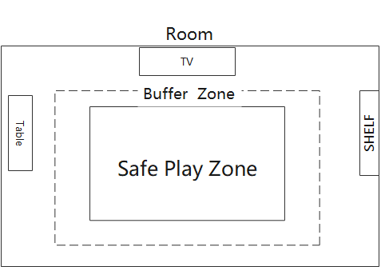
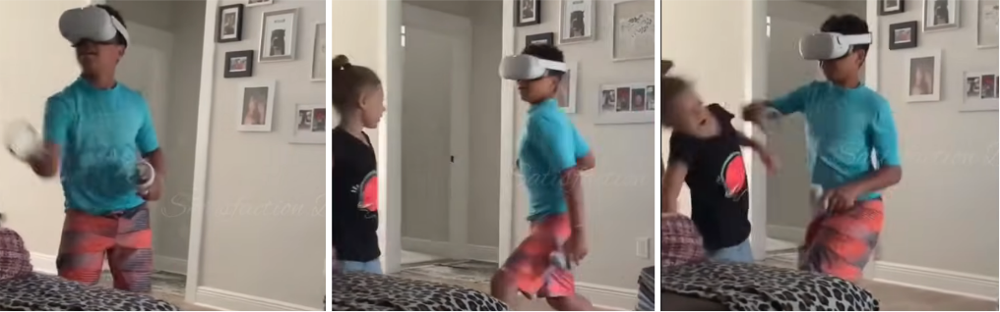

VR is convincing because it replaces your visual world. That also makes it risky: many quick safety checks we rely on in daily life—peripheral awareness, glances at furniture, noticing where other people stand—are largely removed once the headset is on.

This post describes two VR-fail scenarios that can realistically cause collisions or injuries. For each one, it explains what typically triggers it and how to reduce the risk through room setup, system safeguards, and interaction design.

## Scenario 1: Forward charge into a real obstacle (TV stand, wall, furniture)

In this scenario the player does not drift gradually—they commit to forward motion. The clip shows a player stepping rapidly toward the TV, then lunging and effectively diving into it, with the head and upper body taking the impact.

A common trigger is a strong “go forward now” impulse created by the virtual task: chasing a target, dodging an incoming threat, or trying to reach an in-world location quickly. Because the visual scene suggests open space ahead, the player’s body treats forward movement as safe and available, even though the real room has a hard obstacle in that direction. Once momentum builds, there is little time to react, and even a boundary grid can appear too late to prevent impact.

Room layout matters most here. The safest configuration is to ensure the forward direction the player naturally faces has no fragile obstacle within the buffer distance. If a TV is in the room, it should be well outside the buffer zone, or the play space should be rotated so “forward” faces a blank wall.

System safeguards should treat a boundary breach as a reason to stop motion, not merely to display a warning. Pausing the experience, switching to passthrough, or applying a strong peripheral dimming when the player approaches the boundary can break the forward impulse early enough to prevent a run-up. The goal is to interrupt movement before the player accelerates.

Interaction design can further reduce the need to “physically chase” content. When an experience asks the player to reach or interact at a distance, ray-based selection or reach-extension techniques can replace forward stepping. When navigation is needed, teleportation or short step-based movement lowers the chance of a high-speed forward charge in the real room.

## Scenario 2: High-energy arm swings + bystander enters the swing radius (child, friend, pet)

This scenario is driven by fast arm motion. The player focuses on timing and targets, while a bystander steps close enough to enter the swing path. The clip shows a child approaching, and a single controller swing lands on the bystander before either person can react.

The risk increases when the game rewards speed or “big” gestures. Players often exaggerate amplitude to ensure hits, which expands the danger zone and increases impact force. Because the headset blocks eye contact and limits awareness of nearby people, the usual social cues that prevent collisions are missing at the exact moment they are needed.

The first mitigation is strict control of the physical area: close the door, keep pets out, and make it a rule that nobody enters the play space while the headset is on. Wrist straps should be treated as mandatory, because a dropped controller can become a projectile during a fast motion.

System behavior matters as well. In high-energy experiences, boundary breaches should trigger an immediate pause or slow-motion state, not just a subtle visual grid. Warnings must be peripheral and unmissable during action, because small text and gentle overlays are easy to ignore while swinging.

A clear way to communicate the rule is a “no-entry radius” around the player that is larger than normal reach. The diagram below separates an inner reach zone from a larger 1.5 m no-entry radius and makes the action rule explicit: pause when the boundary is breached.

Interaction design can also encourage safer motion. Targets can be positioned to reward compact, wrist-led gestures instead of shoulder-wide swings, and gameplay can avoid repeatedly pulling the player toward the same real-world direction where obstacles or people are likely to be.

## Conclusion

Across both scenarios, the pattern is consistent: VR removes real-world cues, while the experience can encourage fast forward movement or wide swings that exceed the room’s safety margin. Risk reduction comes from a clearly defined safe zone with a real buffer, boundary interventions that pause or force attention early, and interaction techniques that reduce unnecessary running and oversized gestures.
